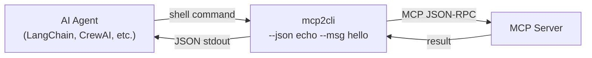

# Letting AI Agents Use MCP Tools Through the CLI

*How to give your AI agents access to any MCP server — without writing a custom MCP client.*

---

## The Problem

You're building an AI agent (LangChain, CrewAI, AutoGPT, custom) that needs to call tools on an MCP server. The typical path:

1. Implement the MCP JSON-RPC protocol
2. Handle session negotiation, capabilities discovery, streaming
3. Parse JSON Schema for tool parameters
4. Manage transport (HTTP or stdio)
5. Handle auth, retries, timeouts

That's weeks of work, and you haven't written a single line of agent logic yet.

## The Solution

Give your agent **shell access** and point it at mcp2cli. The agent calls tools the same way a human would — but parses JSON output.



---

## Setup

### 1. Configure the MCP Server

```bash
mcp2cli config init --name tools --app bridge \
  --transport streamable_http \
  --endpoint http://mcp-server.internal:3001/mcp

mcp2cli link create --name tools
```

### 2. Discover Available Tools

Have the agent discover what's available:

```bash
tools --json ls --tools
```

```json
{
  "app_id": "tools",
  "command": "discover",
  "data": {
    "items": [
      { "id": "search", "kind": "tool", "summary": "Search the knowledge base" },
      { "id": "calculate", "kind": "tool", "summary": "Perform calculations" },
      { "id": "email.send", "kind": "tool", "summary": "Send an email" }
    ]
  }
}
```

### 3. Call Tools from the Agent

```python
import subprocess
import json

def call_mcp_tool(tool_name: str, **kwargs) -> dict:
    """Call an MCP tool via mcp2cli and return structured output."""
    cmd = ["tools", "--json", tool_name]
    for key, value in kwargs.items():
        flag = f"--{key.replace('_', '-')}"
        if isinstance(value, bool):
            if value:
                cmd.append(flag)
        elif isinstance(value, (list, dict)):
            cmd.extend([flag, json.dumps(value)])
        else:
            cmd.extend([flag, str(value)])
    
    result = subprocess.run(cmd, capture_output=True, text=True, timeout=120)
    if result.returncode != 0:
        raise RuntimeError(f"Tool call failed: {result.stderr}")
    
    return json.loads(result.stdout)


# Usage
result = call_mcp_tool("search", query="quarterly revenue report")
print(result["data"]["content"])

result = call_mcp_tool("calculate", expression="42 * 1.15")
print(result["data"]["content"])
```

---

## Agent Framework Integration

### LangChain Tool Wrapper

```python
from langchain.tools import StructuredTool
import subprocess, json

def mcp2cli_tool_factory(tool_id: str, description: str) -> StructuredTool:
    """Create a LangChain tool that delegates to mcp2cli."""
    
    def run_tool(**kwargs) -> str:
        cmd = ["tools", "--json", tool_id]
        for k, v in kwargs.items():
            flag = f"--{k.replace('_', '-')}"
            if isinstance(v, bool) and v:
                cmd.append(flag)
            elif isinstance(v, (list, dict)):
                cmd.extend([flag, json.dumps(v)])
            else:
                cmd.extend([flag, str(v)])
        
        result = subprocess.run(cmd, capture_output=True, text=True, timeout=120)
        output = json.loads(result.stdout)
        # Return just the content text for the LLM
        content = output.get("data", {}).get("content", [])
        return "\n".join(c.get("text", "") for c in content if c.get("type") == "text")
    
    return StructuredTool.from_function(
        func=run_tool,
        name=tool_id,
        description=description,
    )


# Auto-discover and register all tools
discovery = json.loads(
    subprocess.run(
        ["tools", "--json", "ls", "--tools"],
        capture_output=True, text=True
    ).stdout
)

langchain_tools = [
    mcp2cli_tool_factory(item["id"], item["summary"])
    for item in discovery["data"]["items"]
]
```

### CrewAI Integration

```python
from crewai import Agent, Task, Crew
from crewai_tools import tool
import subprocess, json

@tool("MCP Tool Caller")
def call_mcp(tool_name: str, arguments: str) -> str:
    """Call any MCP server tool. Arguments should be JSON: {"key": "value"}"""
    args = json.loads(arguments)
    cmd = ["tools", "--json", tool_name]
    for k, v in args.items():
        cmd.extend([f"--{k.replace('_', '-')}", str(v)])
    
    result = subprocess.run(cmd, capture_output=True, text=True, timeout=120)
    return result.stdout

researcher = Agent(
    role="Research Assistant",
    goal="Answer questions using available MCP tools",
    tools=[call_mcp],
)
```

---

## Dynamic Tool Discovery

The agent can discover tools at runtime and adapt:

```python
def discover_mcp_tools() -> list[dict]:
    """Discover all available MCP tools and their schemas."""
    result = subprocess.run(
        ["tools", "--json", "ls", "--tools"],
        capture_output=True, text=True
    )
    discovery = json.loads(result.stdout)
    return discovery["data"]["items"]

def get_tool_schema(tool_name: str) -> dict:
    """Get detailed schema for a specific tool via inspect."""
    result = subprocess.run(
        ["tools", "--json", "inspect"],
        capture_output=True, text=True
    )
    inspect_data = json.loads(result.stdout)
    capabilities = inspect_data.get("data", {}).get("capabilities", {})
    tools = capabilities.get("tools", [])
    return next((t for t in tools if t["name"] == tool_name), None)
```

---

## Performance: Daemon Mode

For latency-sensitive agents, use the daemon to avoid subprocess/connection overhead:

```bash
# Start daemon once
mcp2cli daemon start tools

# Now every call is ~50ms instead of ~2s
tools --json search --query "report"
```

---

## Prompt Engineering for Agents

Give your agent a system prompt that describes the available tools:

```python
# Auto-generate tool descriptions from discovery
tools_desc = discover_mcp_tools()
tool_prompt = "You have access to the following tools via the CLI:\n\n"
for t in tools_desc:
    tool_prompt += f"- **{t['id']}**: {t['summary']}\n"
tool_prompt += "\nTo call a tool, use: tools --json <tool-name> --arg value"
```

---

## Error Handling

```python
def safe_mcp_call(tool_name: str, timeout: int = 30, **kwargs) -> dict:
    """Call MCP tool with timeout and error handling."""
    cmd = ["tools", "--json", "--timeout", str(timeout), tool_name]
    for k, v in kwargs.items():
        cmd.extend([f"--{k.replace('_', '-')}", str(v)])
    
    try:
        result = subprocess.run(
            cmd, capture_output=True, text=True, timeout=timeout + 5
        )
        if result.returncode != 0:
            return {"error": result.stderr.strip(), "exit_code": result.returncode}
        return json.loads(result.stdout)
    except subprocess.TimeoutExpired:
        return {"error": "timeout", "tool": tool_name}
    except json.JSONDecodeError:
        return {"error": "invalid_response", "raw": result.stdout}
```

---

## Background Operations

For long-running tools, use `--background` and poll:

```python
# Submit background job
result = subprocess.run(
    ["tools", "--json", "export", "--dataset", "full", "--background"],
    capture_output=True, text=True
)
job = json.loads(result.stdout)
job_id = job["data"]["job_id"]

# Poll until complete
import time
while True:
    status = subprocess.run(
        ["tools", "--json", "jobs", "show", job_id],
        capture_output=True, text=True
    )
    job_data = json.loads(status.stdout)
    if job_data["data"]["status"] in ("completed", "failed", "canceled"):
        break
    time.sleep(5)
```

---

## Security Considerations

- **Restrict tool access:** Use profile overlays to `hide` dangerous tools from the agent
- **Timeout enforcement:** Always pass `--timeout` to prevent agents from hanging
- **Rate limiting:** The agent's calling frequency is limited by subprocess overhead (~50ms with daemon)
- **Audit trail:** Enable event sinks to log all tool calls

```yaml
# Profile overlay to restrict agent access
profile:
  hide:
    - admin.delete-all
    - dangerous-tool
events:
  http_endpoint: "http://audit-log/events"
```

---

## See Also

- [Output Formats](../features/output-formats.md) — JSON envelope structure
- [Daemon Mode](../features/daemon-mode.md) — reduce latency for agents
- [Request Timeouts](../features/request-timeouts.md) — prevent hanging
- [Background Jobs](../features/background-jobs.md) — async operations
