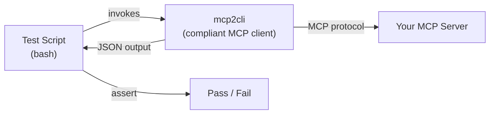

# E2E & Conformance Testing of MCP Servers

*Build structured, reproducible test suites that validate your MCP server against the full protocol specification — using nothing but bash and mcp2cli.*

---

## The Problem

You've built an MCP server. How do you know it actually conforms to the spec? How do you prevent regressions? Writing a custom MCP client in code just to test your server is circular — you'd be testing your test client as much as the server.

**mcp2cli is already a fully compliant MCP client.** Use it as a test harness.



---

## Test Framework in 30 Lines

Here's a minimal bash test framework that wraps mcp2cli:

```bash
#!/bin/bash
# mcp-test-framework.sh — source this in your test scripts

PASS=0; FAIL=0; SKIP=0; ERRORS=""
SERVER="${MCP_TEST_SERVER:-}"  # Set via --url or --stdio

_mcp() { mcp2cli $SERVER --json --timeout "${MCP_TIMEOUT:-30}" "$@" 2>/dev/null; }

assert_ok() {
  local name="$1"; shift
  if output=$(_mcp "$@"); then
    echo "  ✅ $name"; ((PASS++))
  else
    echo "  ❌ $name (exit: $?)"; ((FAIL++))
    ERRORS+="FAIL: $name\n"
  fi
}

assert_fail() {
  local name="$1"; shift
  if _mcp "$@" >/dev/null 2>&1; then
    echo "  ❌ $name (expected failure, got success)"; ((FAIL++))
    ERRORS+="FAIL: $name\n"
  else
    echo "  ✅ $name (correctly rejected)"; ((PASS++))
  fi
}

assert_json() {
  local name="$1" jq_expr="$2"; shift 2
  local output
  if output=$(_mcp "$@"); then
    if echo "$output" | jq -e "$jq_expr" >/dev/null 2>&1; then
      echo "  ✅ $name"; ((PASS++))
    else
      echo "  ❌ $name (assertion failed: $jq_expr)"; ((FAIL++))
      ERRORS+="FAIL: $name — jq: $jq_expr\n"
    fi
  else
    echo "  ❌ $name (command failed)"; ((FAIL++))
    ERRORS+="FAIL: $name\n"
  fi
}

skip_if() {
  local reason="$1" name="$2"
  echo "  ⏭️  $name (skipped: $reason)"; ((SKIP++))
}

summary() {
  echo ""
  echo "═══════════════════════════════════════"
  echo "  Results: $PASS passed, $FAIL failed, $SKIP skipped"
  echo "═══════════════════════════════════════"
  if [ -n "$ERRORS" ]; then
    echo ""; echo "Failures:"; echo -e "$ERRORS"
  fi
  exit $FAIL
}
```

---

## Conformance Test Suite

A complete conformance suite organized by MCP spec section:

### 1. Lifecycle & Initialization

```bash
#!/bin/bash
source ./mcp-test-framework.sh
SERVER="--url http://localhost:3001/mcp"

echo "=== 1. Lifecycle & Initialization ==="

# 1.1 Server responds to initialize
assert_json "initialize succeeds" \
  '.data' \
  inspect

# 1.2 Server reports valid protocol version
assert_json "protocol version is 2025-11-25 or compatible" \
  '.data.protocol_version' \
  inspect

# 1.3 Server declares capabilities
assert_json "server declares capabilities object" \
  '.data.capabilities | type == "object"' \
  inspect

# 1.4 Server provides name and version
assert_json "server info has name" \
  '.data.server_info.name | length > 0' \
  inspect

# 1.5 Ping works after init
assert_ok "ping after initialization" ping

summary
```

### 2. Discovery

```bash
echo "=== 2. Discovery ==="

# 2.1 tools/list returns array
assert_json "tools/list returns items array" \
  '.data.items | type == "array"' \
  ls --tools

# 2.2 Each tool has required fields
assert_json "tools have id and kind" \
  '[.data.items[] | select(.id and .kind)] | length == (.data.items | length)' \
  ls --tools

# 2.3 resources/list returns array
assert_json "resources/list returns items array" \
  '.data.items | type == "array"' \
  ls --resources

# 2.4 prompts/list returns array
assert_json "prompts/list returns items array" \
  '.data.items | type == "array"' \
  ls --prompts

# 2.5 Filtered discovery works
TOOL_COUNT=$(_mcp ls --tools | jq '.data.items | length')
assert_ok "discovery returns $TOOL_COUNT tools" ls --tools

summary
```

### 3. Tool Invocation

```bash
echo "=== 3. Tool Invocation ==="

# Dynamically test each tool
TOOLS=$(_mcp ls --tools | jq -r '.data.items[].id')

for tool in $TOOLS; do
  assert_ok "tool call: $tool" "$tool"
done

# 3.1 Required argument enforcement
# Find a tool with required args and test without them
TOOL_WITH_REQUIRED=$(_mcp ls --tools | jq -r '
  .data.items[] | select(.summary | test("required"; "i")) | .id
' | head -1)

if [ -n "$TOOL_WITH_REQUIRED" ]; then
  assert_fail "required args enforced on $TOOL_WITH_REQUIRED" \
    "$TOOL_WITH_REQUIRED"
else
  skip_if "no tool with known required args" "required arg enforcement"
fi

summary
```

### 4. Resource Reading

```bash
echo "=== 4. Resource Reading ==="

# 4.1 Read each concrete resource
RESOURCES=$(_mcp ls --resources | jq -r '
  .data.items[] | select(.kind == "resource") | .id
')

for uri in $RESOURCES; do
  assert_ok "resource read: $uri" get "$uri"
done

# 4.2 Invalid URI returns error
assert_fail "reject invalid resource URI" get "invalid://nonexistent/resource"

summary
```

### 5. Prompts

```bash
echo "=== 5. Prompt Execution ==="

PROMPTS=$(_mcp ls --prompts | jq -r '.data.items[].id')

for prompt in $PROMPTS; do
  assert_ok "prompt: $prompt" "$prompt"
done

summary
```

### 6. Capability-Gated Features

```bash
echo "=== 6. Capability-Gated Features ==="

# Check if specific capabilities are advertised
CAPS=$(_mcp inspect | jq '.data.capabilities')

# 6.1 Logging
if echo "$CAPS" | jq -e '.logging' >/dev/null 2>&1; then
  assert_ok "set log level: debug" log debug
  assert_ok "set log level: warn" log warn
else
  skip_if "logging not advertised" "log level setting"
fi

# 6.2 Completions
if echo "$CAPS" | jq -e '.completions' >/dev/null 2>&1; then
  assert_ok "completion request" complete ref/prompt "" "" ""
else
  skip_if "completions not advertised" "completion request"
fi

# 6.3 Resource subscriptions
if echo "$CAPS" | jq -e '.resources.subscribe' >/dev/null 2>&1; then
  FIRST_RESOURCE=$(_mcp ls --resources | jq -r '.data.items[0].id // empty')
  if [ -n "$FIRST_RESOURCE" ]; then
    assert_ok "subscribe to resource" subscribe "$FIRST_RESOURCE"
    assert_ok "unsubscribe from resource" unsubscribe "$FIRST_RESOURCE"
  fi
else
  skip_if "subscribe not advertised" "resource subscription"
fi

summary
```

---

## Flow Testing: Script Multi-Step Scenarios

Beyond individual method conformance, test realistic **multi-step workflows** that exercise state and sequencing:

### Auth → Discover → Invoke → Verify Flow

```bash
#!/bin/bash
source ./mcp-test-framework.sh
SERVER="--url http://localhost:3001/mcp"

echo "=== Flow: Auth → Discover → Invoke → Verify ==="

# Step 1: Health check
assert_ok "1. server is healthy" doctor

# Step 2: Discovery succeeds and returns non-empty
assert_json "2. discovery finds at least 1 capability" \
  '.data.items | length > 0' \
  ls

# Step 3: Pick the first tool
FIRST_TOOL=$(_mcp ls --tools | jq -r '.data.items[0].id // empty')
if [ -z "$FIRST_TOOL" ]; then
  echo "  ⏭️  No tools found, skipping invoke flow"
  summary
fi

# Step 4: Invoke it
assert_ok "3. invoke first tool: $FIRST_TOOL" "$FIRST_TOOL"

# Step 5: Verify result has content
assert_json "4. result has content array" \
  '.data.content | type == "array"' \
  "$FIRST_TOOL"

# Step 6: Invoke again — idempotency check
RESULT1=$(_mcp "$FIRST_TOOL" | jq -S '.data.content')
RESULT2=$(_mcp "$FIRST_TOOL" | jq -S '.data.content')
if [ "$RESULT1" = "$RESULT2" ]; then
  echo "  ✅ 5. idempotent tool invocation"; ((PASS++))
else
  echo "  ⚠️  5. non-idempotent tool (not necessarily a bug)"; ((PASS++))
fi

summary
```

### Discovery Cache Invalidation Flow

```bash
echo "=== Flow: Cache Invalidation ==="

# Step 1: First discovery (populates cache)
assert_ok "1. initial discovery" ls

# Step 2: Second discovery (should use cache — fast)
START=$(date +%s%N)
assert_ok "2. cached discovery" ls
END=$(date +%s%N)
CACHED_MS=$(( (END - START) / 1000000 ))
echo "     cache hit latency: ${CACHED_MS}ms"

# Step 3: Verify capabilities are consistent across calls
COUNT1=$(_mcp ls --tools | jq '.data.items | length')
COUNT2=$(_mcp ls --tools | jq '.data.items | length')
if [ "$COUNT1" = "$COUNT2" ]; then
  echo "  ✅ 3. capability count stable ($COUNT1 tools)"; ((PASS++))
else
  echo "  ❌ 3. capability count changed ($COUNT1 vs $COUNT2)"; ((FAIL++))
fi

summary
```

### Background Job Lifecycle Flow

```bash
echo "=== Flow: Background Job Lifecycle ==="

# Only if server supports tasks
CAPS=$(_mcp inspect | jq '.data.capabilities')
if ! echo "$CAPS" | jq -e '.tasks' >/dev/null 2>&1; then
  echo "  ⏭️  Server does not advertise tasks capability"
  summary
fi

# Step 1: Submit background job
FIRST_TOOL=$(_mcp ls --tools | jq -r '.data.items[0].id // empty')
assert_ok "1. submit background job" "$FIRST_TOOL" --background

# Step 2: List jobs
assert_json "2. jobs list is array" \
  'type == "array" or .data | type == "array"' \
  jobs list

# Step 3: Show latest job
assert_ok "3. show latest job" jobs show --latest

# Step 4: Wait for completion
assert_ok "4. wait for job" jobs wait --latest

summary
```

---

## Running the Full Suite

### All-in-One Runner

```bash
#!/bin/bash
# run-conformance.sh — execute all conformance test files

set -euo pipefail

TARGET="${1:?Usage: $0 <--url URL | --stdio CMD>}"
shift
export MCP_TEST_SERVER="$TARGET $*"
export MCP_TIMEOUT=15

echo "╔══════════════════════════════════════════╗"
echo "║   MCP Conformance Test Suite             ║"
echo "║   Target: $MCP_TEST_SERVER"
echo "╚══════════════════════════════════════════╝"
echo ""

TOTAL_PASS=0; TOTAL_FAIL=0; TOTAL_SKIP=0

for test_file in tests/conformance/*.sh; do
  echo ""
  echo "━━━ $(basename "$test_file") ━━━"
  if output=$(bash "$test_file" 2>&1); then
    # Parse results from last line
    pass=$(echo "$output" | grep -oP '\d+ passed' | grep -oP '\d+')
    fail=$(echo "$output" | grep -oP '\d+ failed' | grep -oP '\d+')
    skip=$(echo "$output" | grep -oP '\d+ skipped' | grep -oP '\d+')
    TOTAL_PASS=$((TOTAL_PASS + ${pass:-0}))
    TOTAL_FAIL=$((TOTAL_FAIL + ${fail:-0}))
    TOTAL_SKIP=$((TOTAL_SKIP + ${skip:-0}))
  fi
  echo "$output"
done

echo ""
echo "╔══════════════════════════════════════════╗"
echo "║   TOTAL: $TOTAL_PASS pass, $TOTAL_FAIL fail, $TOTAL_SKIP skip"
echo "╚══════════════════════════════════════════╝"
exit $TOTAL_FAIL
```

### Usage

```bash
# Against an HTTP server
./run-conformance.sh --url http://localhost:3001/mcp

# Against a stdio server
./run-conformance.sh --stdio "npx @modelcontextprotocol/server-everything"

# With custom timeout
MCP_TIMEOUT=60 ./run-conformance.sh --url https://staging.api/mcp
```

---

## CI/CD Integration

### GitHub Actions

```yaml
name: MCP Conformance
on: [push, pull_request]

jobs:
  conformance:
    runs-on: ubuntu-latest
    steps:
      - uses: actions/checkout@v4

      - name: Start MCP server
        run: |
          cargo build --release -p my-mcp-server
          ./target/release/my-mcp-server &
          # Wait for server to be ready
          for i in $(seq 1 30); do
            curl -sf http://localhost:3001/mcp > /dev/null && break
            sleep 1
          done

      - name: Install mcp2cli
        run: cargo install --path .

      - name: Run conformance suite
        run: ./run-conformance.sh --url http://localhost:3001/mcp

      - name: Upload test results
        if: always()
        uses: actions/upload-artifact@v4
        with:
          name: conformance-results
          path: test-results/
```

### Pre-Commit Hook

```bash
#!/bin/bash
# .git/hooks/pre-push

echo "Running MCP conformance tests..."
if ! ./run-conformance.sh --stdio "./target/debug/my-server" > /tmp/mcp-conformance.log 2>&1; then
  echo "❌ Conformance tests failed. See /tmp/mcp-conformance.log"
  exit 1
fi
echo "✅ All conformance tests passed"
```

---

## Spec Coverage Matrix

Track which spec sections your server implements:

```bash
#!/bin/bash
# coverage-matrix.sh — generate a spec coverage report
source ./mcp-test-framework.sh
SERVER="--url http://localhost:3001/mcp"

echo "MCP Spec Coverage Matrix"
echo "========================"
echo ""

# Core
echo "## Core Protocol"
CAPS=$(_mcp inspect)
echo "  initialize:       ✅ (mcp2cli connected)"
echo "  ping:             $(mcp2cli $SERVER --timeout 5 ping >/dev/null 2>&1 && echo '✅' || echo '❌')"

# Capabilities
CAP_JSON=$(echo "$CAPS" | jq -r '.data.capabilities // {}')
check_cap() {
  local name="$1" path="$2"
  if echo "$CAP_JSON" | jq -e "$path" >/dev/null 2>&1; then
    echo "  $name:$(printf '%*s' $((20 - ${#name})) '')✅ advertised"
  else
    echo "  $name:$(printf '%*s' $((20 - ${#name})) '')— not advertised"
  fi
}

echo ""
echo "## Server Capabilities"
check_cap "tools" ".tools"
check_cap "resources" ".resources"
check_cap "prompts" ".prompts"
check_cap "logging" ".logging"
check_cap "completions" ".completions"
check_cap "tasks" ".tasks"
check_cap "resources.subscribe" ".resources.subscribe"

echo ""
echo "## Discovery"
TOOL_COUNT=$(_mcp ls --tools 2>/dev/null | jq '.data.items | length' 2>/dev/null || echo 0)
RES_COUNT=$(_mcp ls --resources 2>/dev/null | jq '.data.items | length' 2>/dev/null || echo 0)
PROMPT_COUNT=$(_mcp ls --prompts 2>/dev/null | jq '.data.items | length' 2>/dev/null || echo 0)
echo "  tools:            $TOOL_COUNT"
echo "  resources:        $RES_COUNT"
echo "  prompts:          $PROMPT_COUNT"
```

Output:

```text
MCP Spec Coverage Matrix
========================

## Core Protocol
  initialize:       ✅ (mcp2cli connected)
  ping:             ✅

## Server Capabilities
  tools:                ✅ advertised
  resources:            ✅ advertised
  prompts:              ✅ advertised
  logging:              ✅ advertised
  completions:          — not advertised
  tasks:                — not advertised
  resources.subscribe:  ✅ advertised

## Discovery
  tools:            12
  resources:        5
  prompts:          3
```

---

## Regression Testing Pattern

Capture golden outputs and diff against them to detect regressions:

```bash
#!/bin/bash
# regression-test.sh — compare against golden baselines

BASELINE_DIR="./test-baselines"
RESULT_DIR="./test-results"
mkdir -p "$RESULT_DIR"

SERVER="--url http://localhost:3001/mcp"

# Capture current state
mcp2cli $SERVER --json ls --tools | jq -S '.data.items | map({id, kind})' > "$RESULT_DIR/tools.json"
mcp2cli $SERVER --json ls --resources | jq -S '.data.items | map({id, kind})' > "$RESULT_DIR/resources.json"
mcp2cli $SERVER --json inspect | jq -S '.data.capabilities' > "$RESULT_DIR/capabilities.json"

# Compare against baseline
DIFFS=0
for file in tools.json resources.json capabilities.json; do
  if [ ! -f "$BASELINE_DIR/$file" ]; then
    echo "⚠️  No baseline for $file — creating"
    cp "$RESULT_DIR/$file" "$BASELINE_DIR/$file"
  elif ! diff -q "$BASELINE_DIR/$file" "$RESULT_DIR/$file" >/dev/null 2>&1; then
    echo "❌ REGRESSION: $file"
    diff --color "$BASELINE_DIR/$file" "$RESULT_DIR/$file"
    ((DIFFS++))
  else
    echo "✅ $file matches baseline"
  fi
done

if [ "$DIFFS" -gt 0 ]; then
  echo ""
  echo "To update baselines: cp $RESULT_DIR/*.json $BASELINE_DIR/"
  exit 1
fi
```

---

## Negative Testing

Test that your server correctly rejects invalid inputs:

```bash
echo "=== Negative Tests ==="

# Invalid JSON-RPC (via raw bridge commands)
assert_fail "reject empty tool name" tool call --name ""
assert_fail "reject nonexistent tool" tool call --name "this-tool-does-not-exist"
assert_fail "reject invalid resource URI" resource read --uri "://broken"

# Type mismatches (if tools have typed schemas)
# e.g., passing string to integer parameter
assert_fail "reject string for integer param" add --a "not-a-number" --b 3

summary
```

---

## Performance Benchmarking

Use mcp2cli to measure server performance:

```bash
#!/bin/bash
# bench.sh — simple latency benchmarks

SERVER="--url http://localhost:3001/mcp"
ITERATIONS=20

echo "=== MCP Server Performance ==="
echo ""

bench() {
  local name="$1"; shift
  local total=0
  for i in $(seq 1 $ITERATIONS); do
    start=$(date +%s%N)
    mcp2cli $SERVER --timeout 30 "$@" >/dev/null 2>&1
    end=$(date +%s%N)
    elapsed=$(( (end - start) / 1000000 ))
    total=$((total + elapsed))
  done
  avg=$((total / ITERATIONS))
  echo "  $name: avg ${avg}ms ($ITERATIONS iterations)"
}

bench "ping" ping
bench "discovery" ls
bench "tool:echo" echo --message test

echo ""
echo "Daemon comparison:"
mcp2cli daemon start bench-server 2>/dev/null

bench "ping (daemon)" ping
bench "tool:echo (daemon)" echo --message test

mcp2cli daemon stop bench-server 2>/dev/null
```

---

## See Also

- [Testing MCP Servers](testing-mcp-servers.md) — quick smoke tests and per-tool validation
- [Shell Scripting with MCP](shell-scripting-mcp.md) — general scripting patterns
- [Ad-Hoc Connections](../features/ad-hoc-connections.md) — `--url`/`--stdio` for stateless testing
- [Output Formats](../features/output-formats.md) — JSON envelope for assertions
- [Request Timeouts](../features/request-timeouts.md) — timeout control for test reliability
