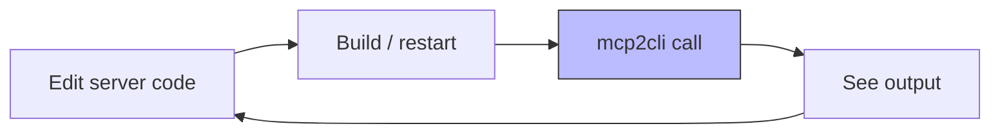

# Local Development & Rapid Prototyping

*Use mcp2cli as your interactive development companion when building MCP servers — instant feedback, live exploration, and fast iteration without writing client code.*

---

## The Development Loop

Building an MCP server means constantly testing whether your tools, resources, and prompts work correctly. Without mcp2cli, you'd need a custom test client, a GUI inspector, or an AI chat interface. Each adds friction.

With mcp2cli, the loop is:

```
Edit server → mcp2cli calls it → see result → repeat
```



---

## Getting Started: Zero Config

Point mcp2cli at your server with zero setup:

```bash
# Your server running locally (HTTP)
mcp2cli --url http://localhost:3001/mcp ls

# Your server as a binary (stdio)
mcp2cli --stdio "./target/debug/my-server" ls

# Python server
mcp2cli --stdio "python server.py" ls

# Node.js server
mcp2cli --stdio "node server.js" ls
```

No config files. No setup ritual. Just point and go.

---

## Workflow 1: Exploring a New Server

You've just cloned someone else's MCP server. What does it do?

```bash
# What does this server offer?
mcp2cli --stdio "./server" ls

# Deep dive — see full capabilities, schemas, everything
mcp2cli --stdio "./server" --json inspect | jq '.'

# What tools are there?
mcp2cli --stdio "./server" ls --tools

# What does the "search" tool expect?
mcp2cli --stdio "./server" --json inspect | jq '
  .data.capabilities.tools[]
  | select(.name == "search")
  | .inputSchema
'

# Try it
mcp2cli --stdio "./server" search --query "hello"
```

Five commands and you understand the entire server API.

---

## Workflow 2: Test-Driven Server Development

Build your server's tools one by one, testing each as you go:

```bash
# Terminal 1: Watch and rebuild
cargo watch -x build

# Terminal 2: Test each tool as you implement it
mcp2cli --stdio "./target/debug/my-server" ls --tools
# → (empty — no tools yet)

# ... implement "greet" tool ...

mcp2cli --stdio "./target/debug/my-server" ls --tools
# → greet  tool  Greets someone by name

mcp2cli --stdio "./target/debug/my-server" greet --name "World"
# → Hello, World!

# JSON to see the full response structure
mcp2cli --stdio "./target/debug/my-server" --json greet --name "World" | jq '.'
```

---

## Workflow 3: Schema Validation

mcp2cli enforces your JSON Schema at the CLI level — it's a free validation layer:

```bash
# Missing required argument
mcp2cli --stdio "./server" create-user
# → error: the following required arguments were not provided: --name

# Wrong type
mcp2cli --stdio "./server" add --a hello --b 3
# → error: invalid value 'hello' for '--a': expected integer

# Invalid enum value
mcp2cli --stdio "./server" set-level --level superverbose
# → possible values: trace, debug, info, warn, error
```

If mcp2cli accepts the input and the server gets called, you know the arguments match the schema. If mcp2cli rejects it, your schema is working correctly.

---

## Workflow 4: Resource Development

Test resources and resource templates as you build them:

```bash
# List available resources
mcp2cli --stdio "./server" ls --resources

# Read a concrete resource
mcp2cli --stdio "./server" get "config://app/settings"

# Test resource templates
mcp2cli --stdio "./server" user-profile --id 42

# Verify MIME types and content
mcp2cli --stdio "./server" --json get "config://app/settings" | jq '.data.content[0]'
# → { "type": "text", "mimeType": "application/json", "text": "{...}" }
```

---

## Workflow 5: Prompt Development

Test prompts with different argument combinations:

```bash
# Simple prompt — no args
mcp2cli --stdio "./server" summarize

# Prompt with arguments
mcp2cli --stdio "./server" code-review --language rust --style concise

# See the full message structure
mcp2cli --stdio "./server" --json code-review --language rust | jq '.data.messages'
```

---

## Workflow 6: Compare Server Versions

Running two versions of your server? Compare their outputs:

```bash
# Old version
OLD=$(mcp2cli --stdio "./target/debug/server-v1" --json ls --tools | jq -S '.data.items[].id')

# New version
NEW=$(mcp2cli --stdio "./target/debug/server-v2" --json ls --tools | jq -S '.data.items[].id')

# What changed?
diff <(echo "$OLD") <(echo "$NEW")
```

---

## Workflow 7: Environment Variable Injection

Test how your server behaves with different configurations:

```bash
# Production mode
mcp2cli --stdio "python server.py" --env MODE=production --env LOG_LEVEL=error ls

# Test mode with mocks
mcp2cli --stdio "python server.py" --env MODE=test --env MOCK_DB=true search --query test

# Different API keys
mcp2cli --stdio "./server" --env API_KEY=test-key-1 ls
mcp2cli --stdio "./server" --env API_KEY=test-key-2 ls
```

---

## Workflow 8: Rapid Prototyping with Demo Mode

Prototype your CLI experience before the server even exists:

```bash
# Use demo mode as a stand-in
mcp2cli --url https://demo.invalid/mcp ls

# Test your profile overlay against demo server
cat > /tmp/prototype-config.yaml << 'EOF'
schema_version: 1
server:
  transport: streamable_http
  endpoint: https://demo.invalid/mcp
profile:
  display_name: "My Future CLI"
  aliases:
    echo: ping
  groups:
    system:
      - echo
      - add
EOF

mcp2cli --config /tmp/prototype-config.yaml ls
# See how your CLI surface will look before writing server code
```

---

## Speed Tips

### Use a Named Config for Your Dev Server

Once you're past the exploration phase, save a config:

```bash
mcp2cli config init --name dev --transport stdio \
  --stdio-command ./target/debug/my-server
mcp2cli use dev

# Now just:
mcp2cli ls
mcp2cli greet --name test
```

### Use the Daemon for Stdio Servers

Avoid the subprocess startup overhead on every call:

```bash
mcp2cli daemon start dev

# Every call is instant now
mcp2cli greet --name test1   # ~50ms
mcp2cli greet --name test2   # ~50ms
mcp2cli greet --name test3   # ~50ms

mcp2cli daemon stop dev
```

### Alias for One-Handed Usage

```bash
mcp2cli link create --name d  # Short alias

d ls
d greet --name test
d --json inspect | jq '.'
```

---

## See Also

- [Getting Started](../getting-started.md) — initial setup guide
- [Transports](../features/transports.md) — stdio and HTTP transport details
- [Ad-Hoc Connections](../features/ad-hoc-connections.md) — `--url`/`--stdio` explained
- [E2E & Conformance Testing](e2e-conformance-testing.md) — structured test suites
- [Daemon Mode](../features/daemon-mode.md) — fast iteration with warm connections
