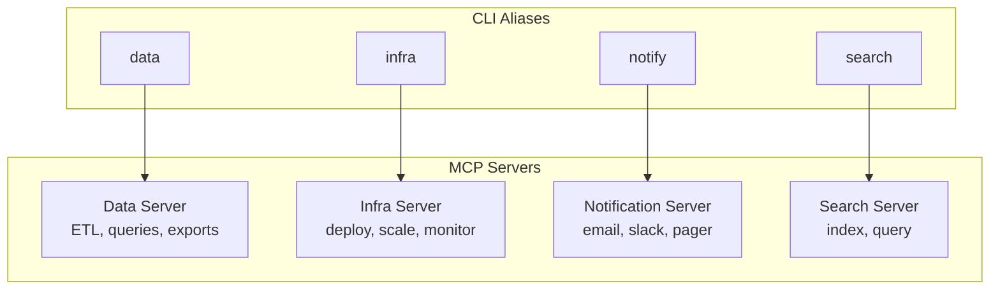

# Multi-Server Workflows

*Orchestrate multiple MCP servers for complex workflows — data pipelines, multi-environment management, and cross-service automation.*

---

## The Setup

Most production workflows involve multiple MCP servers — one for data, one for infrastructure, one for notifications. mcp2cli's named configs and symlink aliases make each server feel like its own CLI.



---

## Setup Multiple Servers

```bash
# Data server
mcp2cli config init --name data --transport streamable_http \
  --endpoint http://data-api.internal:3001/mcp
mcp2cli link create --name data

# Infrastructure server
mcp2cli config init --name infra --transport streamable_http \
  --endpoint http://infra-api.internal:3001/mcp
mcp2cli link create --name infra

# Notification server
mcp2cli config init --name notify --transport stdio \
  --stdio-command ./notify-server \
  --stdio-args '--config=prod.yaml'
mcp2cli link create --name notify

# Search server
mcp2cli config init --name search --transport streamable_http \
  --endpoint http://search-api.internal:3001/mcp
mcp2cli link create --name search
```

Verify:

```bash
mcp2cli config list
data doctor
infra doctor
notify doctor
search doctor
```

---

## Pattern: Data Pipeline

Extract data from one server, transform it, load it into another.

```bash
#!/bin/bash
set -euo pipefail

echo "=== Daily Data Pipeline ==="

# Step 1: Extract from data server
echo "Extracting user data..."
USERS=$(data --json export-users --since "$(date -d 'yesterday' +%Y-%m-%d)" --format json)
echo "$USERS" > /tmp/pipeline/users.json
COUNT=$(echo "$USERS" | jq '.data.records | length')
echo "Extracted $COUNT users"

# Step 2: Query search server for enrichment
echo "Enriching with search data..."
echo "$USERS" | jq -r '.data.records[].email' | while read email; do
  search --json query --index users --q "email:$email" >> /tmp/pipeline/enriched.ndjson
done

# Step 3: Load into data server
echo "Loading enriched data..."
data --json import --source /tmp/pipeline/enriched.ndjson --target enriched_users

# Step 4: Notify
echo "Sending notification..."
notify --json send-slack \
  --channel "#data-pipeline" \
  --message "Daily pipeline complete: $COUNT users processed"

echo "✅ Pipeline complete"
```

---

## Pattern: Multi-Environment Deployment

Roll out across dev → staging → production with gates:

```bash
#!/bin/bash
set -euo pipefail

VERSION="${1:?Usage: $0 <version>}"

deploy_and_verify() {
  local env="$1"
  echo "--- Deploying to $env ---"
  
  # Deploy
  "$env" --json deploy --version "$VERSION" --timeout 300
  
  # Verify
  echo "Verifying $env..."
  "$env" --timeout 10 ping
  
  HEALTH=$("$env" --json doctor | jq -r '.summary')
  echo "$env: $HEALTH"
}

# Dev — deploy immediately
deploy_and_verify dev

# Staging — deploy and run smoke tests
deploy_and_verify staging
echo "Running staging smoke tests..."
staging --json echo --message "smoke-test" | jq -e '.data.content' > /dev/null
staging --json ls --tools | jq -e '.data.items | length > 0' > /dev/null
echo "✅ Staging smoke tests passed"

# Production — with confirmation gate
read -p "Deploy v$VERSION to production? (y/N) " -n 1 -r
echo
if [[ $REPLY =~ ^[Yy]$ ]]; then
  deploy_and_verify prod
  notify --json send-slack \
    --channel "#releases" \
    --message "✅ v$VERSION deployed to all environments"
else
  echo "Production deploy skipped"
fi
```

---

## Pattern: Cross-Service Orchestration

Combine tools from multiple servers in a single workflow:

```bash
#!/bin/bash
# Incident response automation

INCIDENT_ID="${1:?Usage: $0 <incident-id>}"

echo "=== Incident Response: $INCIDENT_ID ==="

# 1. Get incident details from data server
INCIDENT=$(data --json get-incident --id "$INCIDENT_ID")
SEVERITY=$(echo "$INCIDENT" | jq -r '.data.severity')
SERVICE=$(echo "$INCIDENT" | jq -r '.data.affected_service')

echo "Severity: $SEVERITY, Service: $SERVICE"

# 2. Scale up affected service (infra server)
if [ "$SEVERITY" = "critical" ]; then
  echo "Scaling up $SERVICE..."
  infra --json scale --service "$SERVICE" --replicas 10
fi

# 3. Search logs for related errors (search server)
echo "Searching logs..."
ERRORS=$(search --json query \
  --index logs \
  --q "service:$SERVICE AND level:error AND @timestamp:[now-1h TO now]" \
  --limit 10)
ERROR_COUNT=$(echo "$ERRORS" | jq '.data.hits.total')
echo "Found $ERROR_COUNT related errors"

# 4. Notify team (notification server)
notify --json send-pager \
  --team "$SERVICE-oncall" \
  --message "Incident $INCIDENT_ID: $SEVERITY on $SERVICE. $ERROR_COUNT errors in last hour."

notify --json send-slack \
  --channel "#incidents" \
  --message "🚨 Incident $INCIDENT_ID opened. Severity: $SEVERITY. Service: $SERVICE. Auto-scaled to 10 replicas."
```

---

## Pattern: Parallel Server Health Check

```bash
#!/bin/bash
# Check all servers in parallel

SERVERS=("data" "infra" "notify" "search")
RESULTS=""

for server in "${SERVERS[@]}"; do
  (
    if "$server" --timeout 5 --json ping >/dev/null 2>&1; then
      echo "$server: UP"
    else
      echo "$server: DOWN"
    fi
  ) &
done

wait

# Structured output
echo ""
echo "=== Server Status ==="
for server in "${SERVERS[@]}"; do
  STATUS=$("$server" --timeout 5 --json ping 2>/dev/null | jq -r '.summary' || echo "unreachable")
  echo "  $server: $STATUS"
done
```

---

## Performance: Daemon Mode for Multi-Server

When orchestrating multiple servers in a tight loop, use daemons to eliminate startup overhead:

```bash
# Start daemons for all servers
for server in data infra notify search; do
  mcp2cli daemon start "$server"
done

# Now each call is ~50ms instead of ~2s
data --json query --sql "SELECT count(*) FROM users"    # instant
infra --json status --service api                        # instant
search --json query --q "error"                          # instant

# Cleanup
for server in data infra notify search; do
  mcp2cli daemon stop "$server"
done
```

---

## Per-Server Profile Customization

Make each server alias feel hand-crafted:

```yaml
# configs/data.yaml
profile:
  display_name: "Data Platform"
  aliases:
    run-query: query
    export-dataset: export
  groups:
    etl:
      - extract
      - transform
      - load

# configs/infra.yaml
profile:
  display_name: "Infrastructure"
  groups:
    cluster:
      - deploy
      - rollback
      - scale
    monitor:
      - status
      - logs
      - metrics
```

```bash
data etl extract --source users
data query --sql "SELECT * FROM users LIMIT 10"

infra cluster deploy --version 2.0
infra monitor status --service api
```

---

## See Also

- [Named Configs & Aliases](../features/named-configs-and-aliases.md) — multi-config setup
- [Daemon Mode](../features/daemon-mode.md) — warm connections for performance
- [Shell Scripting with MCP](shell-scripting-mcp.md) — foundational scripting patterns
- [From Zero to Production](from-zero-to-production.md) — end-to-end production setup
