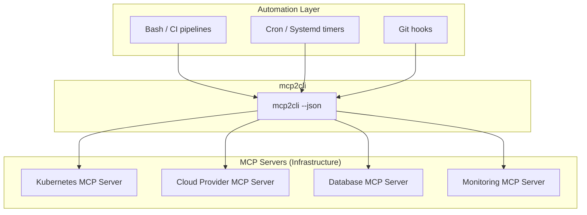

# Platform Engineering & Infrastructure Automation

*Treat MCP servers as infrastructure APIs — provision, monitor, gate deployments, and orchestrate from scripts and pipelines.*

---

## MCP as an Infrastructure API

MCP servers can wrap any backend: cloud APIs, databases, CI/CD systems, monitoring stacks. mcp2cli gives you a CLI layer over all of them — no SDK, no client library, just shell commands with JSON output.



---

## Setup: One Alias Per Infrastructure Service

```bash
# Kubernetes cluster management
mcp2cli config init --name k8s --transport streamable_http \
  --endpoint http://k8s-mcp.internal:3001/mcp
mcp2cli link create --name k8s

# Cloud operations
mcp2cli config init --name cloud --transport streamable_http \
  --endpoint http://cloud-mcp.internal:3001/mcp
mcp2cli link create --name cloud

# Database
mcp2cli config init --name db --transport stdio \
  --stdio-command ./db-mcp-server --stdio-args '--config=prod.yaml'
mcp2cli link create --name db

# Monitoring
mcp2cli config init --name mon --transport streamable_http \
  --endpoint http://monitoring-mcp.internal:3001/mcp
mcp2cli link create --name mon
```

---

## Pattern: Deployment Gate

Gate releases on health checks and capacity:

```bash
#!/bin/bash
set -euo pipefail
VERSION="$1"

echo "=== Pre-deployment checks ==="

# 1. Cluster has capacity
NODES=$(k8s --json get-nodes | jq '[.data.items[] | select(.status == "ready")] | length')
if [ "$NODES" -lt 3 ]; then
  echo "❌ Only $NODES healthy nodes (need 3+)"
  exit 1
fi
echo "✅ $NODES healthy nodes"

# 2. No ongoing incidents
INCIDENTS=$(mon --json active-incidents | jq '.data.incidents | length')
if [ "$INCIDENTS" -gt 0 ]; then
  echo "❌ $INCIDENTS active incidents — deploy blocked"
  exit 1
fi
echo "✅ No active incidents"

# 3. Database migrations clean
PENDING=$(db --json migration-status | jq '.data.pending | length')
if [ "$PENDING" -gt 0 ]; then
  echo "⚠️  $PENDING pending migrations — running..."
  db migrate --version "$VERSION"
fi
echo "✅ Database schema current"

# 4. Deploy
echo "=== Deploying v$VERSION ==="
k8s deploy --image "registry.internal/app:$VERSION" --strategy rolling

# 5. Post-deploy verification
sleep 10
HEALTHY=$(k8s --json get-pods --label "version=$VERSION" | jq '[.data.items[] | select(.status == "running")] | length')
echo "✅ $HEALTHY pods running v$VERSION"
```

---

## Pattern: Infrastructure Health Dashboard

A script that generates a health report from multiple MCP servers:

```bash
#!/bin/bash
# infra-status.sh — run every 5 minutes via cron

REPORT=""

add() { REPORT+="$1\n"; }

add "# Infrastructure Status — $(date -Iseconds)"
add ""

# Kubernetes
if k8s --timeout 5 ping >/dev/null 2>&1; then
  NODE_COUNT=$(k8s --json get-nodes | jq '.data.items | length')
  POD_COUNT=$(k8s --json get-pods | jq '.data.items | length')
  add "## Kubernetes: ✅ UP"
  add "- Nodes: $NODE_COUNT"
  add "- Pods: $POD_COUNT"
else
  add "## Kubernetes: ❌ DOWN"
fi
add ""

# Database
if db --timeout 5 ping >/dev/null 2>&1; then
  CONN=$(db --json pool-status | jq '.data.active_connections')
  add "## Database: ✅ UP"
  add "- Active connections: $CONN"
else
  add "## Database: ❌ DOWN"
fi
add ""

# Monitoring
if mon --timeout 5 ping >/dev/null 2>&1; then
  ALERTS=$(mon --json active-alerts | jq '.data.alerts | length')
  add "## Monitoring: ✅ UP"
  add "- Active alerts: $ALERTS"
else
  add "## Monitoring: ❌ DOWN"
fi

echo -e "$REPORT" > /var/www/status/index.md
echo -e "$REPORT"  # Also to stdout for cron mail
```

---

## Pattern: Automated Scaling

```bash
#!/bin/bash
# auto-scale.sh — triggered by monitoring alert

SERVICE="$1"
DIRECTION="$2"  # up or down

CURRENT=$(k8s --json get-deployment --name "$SERVICE" | jq '.data.replicas')

case "$DIRECTION" in
  up)   TARGET=$((CURRENT * 2)) ;;
  down) TARGET=$((CURRENT / 2)); [ "$TARGET" -lt 1 ] && TARGET=1 ;;
  *)    echo "Usage: $0 <service> <up|down>"; exit 1 ;;
esac

echo "Scaling $SERVICE: $CURRENT → $TARGET replicas"
k8s scale --deployment "$SERVICE" --replicas "$TARGET"

# Notify
mon --json create-annotation \
  --dashboard infrastructure \
  --text "Auto-scaled $SERVICE: $CURRENT → $TARGET" \
  --tags '["autoscale","'$SERVICE'"]'
```

---

## Pattern: Database Operations Pipeline

```bash
#!/bin/bash
# db-maintenance.sh — weekly maintenance

echo "=== Weekly Database Maintenance ==="

# 1. Create backup
echo "Creating backup..."
BACKUP=$(db --json backup --format pg_dump --compress)
BACKUP_ID=$(echo "$BACKUP" | jq -r '.data.backup_id')
echo "Backup: $BACKUP_ID"

# 2. Run VACUUM
echo "Running VACUUM ANALYZE..."
db --json vacuum --analyze --timeout 0

# 3. Check for bloat
BLOAT=$(db --json table-stats | jq '[.data.tables[] | select(.bloat_ratio > 0.3)] | length')
if [ "$BLOAT" -gt 0 ]; then
  echo "⚠️  $BLOAT tables with >30% bloat"
  db --json table-stats | jq '.data.tables[] | select(.bloat_ratio > 0.3) | {name, bloat_ratio}'
fi

# 4. Report
echo "✅ Maintenance complete (backup: $BACKUP_ID)"
```

---

## Pattern: GitOps Sync Verification

Verify that your deployed state matches your git config:

```bash
#!/bin/bash
# gitops-verify.sh

echo "=== GitOps State Verification ==="

DIFFS=0

# Check each service
for svc in api worker scheduler; do
  EXPECTED_VERSION=$(yq ".services.$svc.image" deploy/config.yaml | grep -oP ':\K.*')
  ACTUAL_VERSION=$(k8s --json get-deployment --name "$svc" | jq -r '.data.image_tag')
  
  if [ "$EXPECTED_VERSION" = "$ACTUAL_VERSION" ]; then
    echo "  ✅ $svc: $ACTUAL_VERSION"
  else
    echo "  ❌ $svc: expected $EXPECTED_VERSION, got $ACTUAL_VERSION"
    ((DIFFS++))
  fi
done

# Check config maps
for cm in app-config feature-flags; do
  LOCAL_HASH=$(sha256sum "deploy/$cm.yaml" | cut -d' ' -f1)
  REMOTE_HASH=$(k8s --json get-configmap --name "$cm" | jq -r '.data.hash')
  
  if [ "$LOCAL_HASH" = "$REMOTE_HASH" ]; then
    echo "  ✅ configmap/$cm: in sync"
  else
    echo "  ❌ configmap/$cm: drift detected"
    ((DIFFS++))
  fi
done

if [ "$DIFFS" -gt 0 ]; then
  echo ""
  echo "❌ $DIFFS drift(s) detected"
  exit 1
fi
echo "✅ All services in sync with git"
```

---

## Event-Driven Infrastructure

Use mcp2cli's event sinks to trigger automation:

```yaml
# k8s config with event routing
events:
  command: |
    if [ "$MCP_EVENT_TYPE" = "list_changed" ]; then
      # Capabilities changed — re-sync discovery
      k8s ls > /dev/null
    fi
  http_endpoint: "http://alertmanager:9093/api/v1/alerts"
```

---

## Multi-Environment Configuration

```bash
# configs/k8s-dev.yaml, k8s-staging.yaml, k8s-prod.yaml
for env in dev staging prod; do
  mcp2cli config init --name "k8s-$env" --transport streamable_http \
    --endpoint "http://k8s-mcp-$env.internal:3001/mcp"
  mcp2cli link create --name "k8s-$env"
done

# Now:
k8s-dev get-pods
k8s-staging deploy --image app:v2
k8s-prod get-pods
```

---

## Daemon for Hot Paths

For scripts that make many sequential calls:

```bash
# Start daemons for all infrastructure services
for svc in k8s cloud db mon; do
  mcp2cli daemon start "$svc"
done

# Run your pipeline (each call ~50ms instead of ~2s)
./deploy-pipeline.sh

# Clean up
for svc in k8s cloud db mon; do
  mcp2cli daemon stop "$svc"
done
```

---

## See Also

- [Multi-Server Workflows](multi-server-workflows.md) — orchestrating across servers
- [Shell Scripting with MCP](shell-scripting-mcp.md) — foundational bash patterns
- [From Zero to Production](from-zero-to-production.md) — end-to-end setup
- [Background Jobs](../features/background-jobs.md) — long-running infrastructure operations
- [Event System](../features/event-system.md) — event-driven automation
