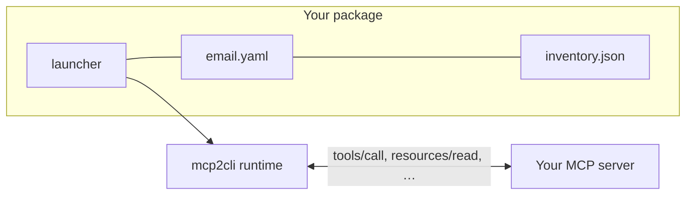

# Ship Your MCP Server as a CLI

You have an MCP server. This guide turns it into a command-line application your users install with one command and run under your name — with typed flags, `--help`, login, and JSON output — without writing a CLI.

```bash
npx @acme/email-cli send --to user@example.com --subject "Hello"
```

**Who this is for:** MCP server authors who want a CLI for humans, scripts and AI agents, and would rather not maintain a second codebase that re-implements every tool as a subcommand.

**What you will have at the end:** an npm package (or a plain directory, for other package managers) containing a config, a command-list snapshot and a five-line launcher. The mcp2cli runtime does the rest, and none of it shows.

---

## How it works

Your tools already describe themselves: each has a name, a description and a JSON Schema for its input. mcp2cli reads those and builds the CLI at run time — a subcommand per tool, a typed `--flag` per schema property, required-field validation, enum choices, help text.



Because the CLI is derived, it cannot drift from the server: add a tool, refresh the snapshot, publish. There is no command code to write or keep in sync.

---

## Before you start

- **mcp2cli** on your machine — see [Getting Started](../getting-started.md).
- **Your MCP server**, reachable the way your users will reach it: a public HTTPS endpoint (streamable HTTP), or a command that starts it over stdio.
- **Node.js 18+** and an npm account, for the npm route.

The examples use an email server at `https://mcp.acme.example/email`, published as `@acme/email-cli` with the command `email`. Replace those three as you go.

---

## Step 1 — Bind the server

Create a named config and an alias, exactly as you would for personal use. This is your workbench: you shape the CLI here, then package it.

```bash
# Remote server
mcp2cli config init --name email --endpoint https://mcp.acme.example/email

# …or a server started over stdio
mcp2cli config init --name email --transport stdio \
  --stdio-command npx --stdio-arg=-y --stdio-arg @acme/email-mcp

mcp2cli link create --name email
```

If the server needs authentication, log in now — see [Step 4](#step-4--login).

```bash
email --help
```

The first run discovers the server's capabilities, so this already lists your tools.

---

## Step 2 — Shape the commands

Look at that help screen the way a new user would. Tool names that are fine for a model (`email_send_message_v2`) are not fine on a command line. A [profile overlay](../features/profile-overlays.md) in `~/.config/mcp2cli/configs/email.yaml` fixes that without touching the server:

```yaml
profile:
  aliases:
    email_send_message_v2: send
    email_search_messages: search
  hide:
    - debug_dump_state            # internal; not for users
  groups:
    labels:                       # `email labels add`, `email labels list`
      - labels.add
      - labels.list
  flags:
    send:
      recipient_address: to       # --recipient-address → --to
```

Iterate with `email --help` and `email send --help` until it reads like a CLI someone designed. Dotted tool names that share a prefix (`labels.add`, `labels.list`) already nest into subcommands on their own.

Two things pay off disproportionately:

- **Descriptions.** The tool's `description` becomes the command's help line, and each property's `description` becomes its flag help. Improving them on the server improves the CLI *and* how well models use the tool.
- **`required` and `enum` in your schemas.** They become required-argument errors and `[possible values: …]` in help, for free.

---

## Step 3 — Package it

```bash
mcp2cli package init --name email \
  --package-name @acme/email-cli \
  --package-version 1.0.0 \
  --about "Send and search Acme Mail from your terminal"
```

```text
package: ./email-cli
target: npm
built-in commands: auth
snapshot: 14 capabilities
files:
  email.yaml
  inventory.json
  bin/email.js
  package.json
  README.md
```

| File | What it is |
|------|------------|
| `email.yaml` | Your server binding and profile, plus a `branding:` section. This is the file you edit from now on |
| `inventory.json` | Snapshot of the server's tools, resources and prompts — why `--help` works instantly, offline, and before login |
| `bin/email.js` | Launcher: starts the runtime as `email`, bound to the two files above |
| `package.json` | Declares the `email` command and depends on the `mcp2cli` runtime package |

For a stdio server, read the `warning:` lines in the output. `server.stdio.env` is **not** copied — that is where API keys live, and a package is public — and neither is `cwd` or anything else tied to your machine. Make sure `email.yaml` starts the server in a way that works anywhere, such as `npx -y @acme/email-mcp`.

Try it exactly as a user would get it:

```bash
cd email-cli
npm install
node bin/email.js --help
```

```text
Send and search Acme Mail from your terminal

Usage: email [OPTIONS] <COMMAND>

Commands:
  send     Send an email message
  search   Search messages
  labels   labels commands
  get      Fetch a resource by URI
  auth     Authentication management

Options:
      --json               Output in JSON format
      --output <output>    Output format [possible values: human, json, ndjson]
      --non-interactive    Fail instead of prompting (CI mode)
      --input-json <JSON>  Provide elicitation answers as a JSON object (CI mode)
      --timeout <SECONDS>  Operation timeout in seconds (0 = no timeout)
  -h, --help               Print help
  -V, --version            Print version
```

No `doctor`, no `tool call`, no mention of mcp2cli, and `email --version` prints `email 1.0.0` — the version from your `package.json`.

### Choosing built-in commands

`package init` exposes `auth` for a remote server and nothing for a stdio server. Add others with `--builtin`, or edit `branding.builtin_commands` afterwards:

```yaml
branding:
  name: email
  about: Send and search Acme Mail from your terminal
  builtin_commands: [auth, jobs, ls]
```

- **`jobs`** — if some tools take long enough that users will want `--background`. The flag only appears on tools when `jobs` is exposed.
- **`ls`** — lets users list capabilities and refresh the command list between your releases.
- **`doctor`, `ping`** — self-service diagnostics. Useful if you field support requests.

Every built-in you expose is a command you document. Start small. The full list is in the [Branded CLI reference](../features/branded-cli.md#built-in-commands).

---

## Step 4 — Login

Users authenticate with a command you get for free:

```bash
email auth login
email auth status
email auth logout
```

`auth login` picks the flow from what it is given:

| Situation | What happens |
|-----------|--------------|
| Interactive terminal, server advertises OAuth | Opens the browser: OAuth 2.1 authorization code + PKCE, with dynamic client registration and a loopback redirect |
| A token is piped in | `echo "$TOKEN" \| email auth login` stores it as a bearer token |
| `--input-json '{"bearer_token": "…"}'` | Same, from a structured payload |
| `--non-interactive` and no token | Fails immediately instead of waiting on a browser — what you want in CI |

### What your server needs for browser login

Nothing mcp2cli-specific — the [MCP authorization spec](https://modelcontextprotocol.io/specification/draft/basic/authorization):

1. Answer unauthenticated requests with `401` and a `WWW-Authenticate` header pointing at your protected-resource metadata.
2. Serve `/.well-known/oauth-protected-resource`, naming your authorization server.
3. The authorization server publishes its metadata and supports **dynamic client registration** and **PKCE (S256)**.

The CLI registers itself under `branding.name`, so your consent screen reads *"email wants to access your account"* — not mcp2cli. It sends the MCP `resource` parameter, validates `state` on the loopback callback, and checks the `iss` parameter against the discovered issuer.

If your server uses API keys rather than OAuth, that works today too — users pipe the key to `auth login`, and every request carries `Authorization: Bearer <key>`.

### Where credentials live

```text
~/.local/share/email/instances/email/tokens.json          # Linux
~/Library/Application Support/email/instances/email/…     # macOS
```

Owner-only permissions (`0600`), in a data directory named after **your** CLI. It shares nothing with a user's own mcp2cli setup, even if they have a config with the same name — including when they have `MCP2CLI_DATA_DIR` exported, where your CLI gets its own `apps/<name>` subdirectory.

### Help works before login

A protected server cannot be asked for its tool list until the user has logged in — and `--help` is the first thing a new user runs. This is what the snapshot is for: `email --help` and `email send --help` are answered from `inventory.json`, with no request to the server at all. `auth` itself never waits on the server either.

Without a snapshot, a logged-out user sees this instead of a command list:

```text
error: could not load the command list from Acme Mail: …

If the server requires authentication, run `email auth login` first.
```

Correct, but not the first impression you want. Ship the snapshot.

### Login in CI

```bash
echo "$ACME_TOKEN" | email auth login --non-interactive
email --json send --to ops@acme.example --subject "Deploy finished"
```

`--non-interactive` also makes any mid-command prompt (an [elicitation](../features/elicitation-and-sampling.md) from your server) fail fast; supply the answers up front with `--input-json`.

---

## Step 5 — Publish

```bash
npm run snapshot          # refresh inventory.json from the live server
npm publish --access public
```

Your users:

```bash
npm install -g @acme/email-cli && email --help
# or, without installing
npx @acme/email-cli --help
```

The install pulls in the `mcp2cli` runtime package and exactly one prebuilt binary for the user's platform (Linux and macOS, x64 and arm64). There is no postinstall script and nothing is downloaded at install time, so it behaves in locked-down CI and behind proxies. The Linux binaries are static, so they run on Alpine and on old distributions alike.

---

## Step 6 — Keep it current

Your package pins nothing about the server except the snapshot. When the server changes:

| Server change | What to do |
|---------------|------------|
| New or changed tool | `npm run snapshot`, bump the version, publish |
| Renamed tool | Same — and add a `profile.aliases` entry if you want the old command name to keep working |
| Removed tool | Same. Until users upgrade, the stale command fails with the server's own "unknown tool" error |

Make `npm run snapshot` a step of your server's release pipeline and the two cannot diverge.

To let installed CLIs pick up changes **without** a new release, set a TTL. When a user runs a command and the list is older than that, the CLI re-discovers first, and silently keeps the old list if the refresh fails. `--help` never triggers a refresh, so it stays instant and offline:

```yaml
discovery:
  snapshot: inventory.json
  ttl_seconds: 86400
```

`package snapshot` authenticates as you. `npm run snapshot` reads the packaged config, so it uses the credentials of a login made through the package (`node bin/email.js auth login`). To use your workbench alias's login instead, snapshot from the named config:

```bash
mcp2cli package snapshot --from email --out inventory.json
```

---

## Beyond npm

`--target shell` generates a POSIX launcher instead of an npm package:

```bash
mcp2cli package init --name email --target shell --out ./email-cli
```

Ship that directory next to the `mcp2cli` binary — in a Homebrew formula, a `.deb`, a tarball, or a container image:

```dockerfile
FROM alpine:3
# The static (musl) mcp2cli binary from the GitHub release
COPY mcp2cli /usr/local/bin/mcp2cli
COPY email-cli /opt/email-cli
RUN ln -s /opt/email-cli/bin/email /usr/local/bin/email
ENTRYPOINT ["email"]
```

For any other ecosystem, a launcher is two environment variables:

```bash
MCP2CLI_INVOKED_AS=email MCP2CLI_CONFIG=/opt/email-cli/email.yaml exec mcp2cli "$@"
```

---

## For AI agents

A CLI is often the most economical way to give an agent your tools: no MCP client to configure, no tool schemas occupying the context window, and `--help` is a discovery protocol every model already knows.

```bash
email --help                 # what can I do?
email send --help            # how do I do it?
email --json send --to …     # do it, get structured output
```

Two details make this reliable:

- **`--json`** prints the result as one JSON envelope on stdout. Errors go to stderr and the exit code is non-zero, so success is never ambiguous.
- **`--non-interactive`** guarantees the CLI never blocks waiting for input an agent cannot give.

---

## Checklist

- [ ] Command and flag names read well in `--help` (profile overlay)
- [ ] Tool and property descriptions are written for humans
- [ ] `branding.about` is one clear sentence
- [ ] Only the built-ins you intend to support are listed
- [ ] `inventory.json` is present and fresh — test with the network off: `email --help`
- [ ] Fresh-machine test: a clean `HOME`, no mcp2cli installed, `npx <your-package> --help`
- [ ] Logged-out test: `email --help` lists commands; a real command gives a clear error pointing to `email auth login`
- [ ] `npm run snapshot` is part of your release process

---

## See Also

- [Branded CLI](../features/branded-cli.md) — reference for `branding`, `discovery`, and `mcp2cli package`
- [Profile Overlays](../features/profile-overlays.md) — renaming, grouping, hiding
- [Authentication](../features/authentication.md) — the login flows in detail
- [AI Agents + MCP via CLI](ai-agents-mcp-cli.md) — using CLIs as agent tools
