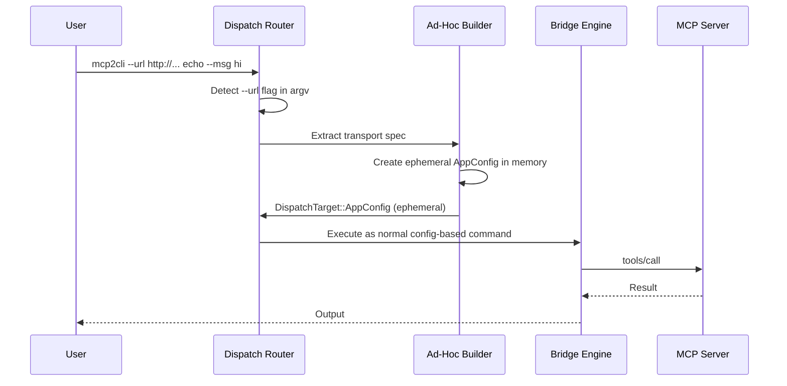

# Ad-Hoc Connections

Connect to any MCP server instantly with `--url` or `--stdio` — no config file needed.

---

## Why Ad-Hoc?

Sometimes you just want to test a server, poke at a quick endpoint, or integrate into a script without creating a persistent config. Ad-hoc flags create an **ephemeral in-memory config** that exists only for the duration of the command.

---

## Usage

### HTTP Server

```bash
mcp2cli --url http://127.0.0.1:3001/mcp ls
mcp2cli --url http://127.0.0.1:3001/mcp echo --message hello
mcp2cli --url https://prod.api.company.com/mcp doctor
```

### Stdio Server

```bash
mcp2cli --stdio "npx @modelcontextprotocol/server-everything" ls
mcp2cli --stdio "python my_server.py" echo --message hello
mcp2cli --stdio "./target/debug/my-server" doctor
```

### Stdio with Environment Variables

Pass environment variables to the subprocess with `--env`:

```bash
mcp2cli --stdio "python server.py" \
  --env API_KEY=sk-abc123 \
  --env DB_URL=postgres://localhost/mydb \
  echo --message hello
```

Multiple `--env` flags are supported. Each must be in `KEY=VALUE` format.

### Combining with Other Flags

Ad-hoc flags work with all other mcp2cli features:

```bash
# JSON output
mcp2cli --url http://localhost:3001/mcp --json ls

# Timeout
mcp2cli --url http://localhost:3001/mcp --timeout 10 deploy --version 1.0

# NDJSON streaming
mcp2cli --stdio "npx server" --output ndjson ls
```

---

## How It Works



1. **Flag detection:** Before config resolution, the dispatch router scans argv for `--url` or `--stdio`
2. **Config synthesis:** An ephemeral `AppConfig` is created in memory with appropriate transport settings
3. **Flag stripping:** `--url`, `--stdio`, and `--env` are removed from argv before command parsing
4. **Normal execution:** The rest of the pipeline runs identically to a named config

### Config Name Inference

The ephemeral config gets an auto-derived name:

| Flag | Name derived from |
|------|------------------|
| `--url http://mcp.example.com/path` | `mcp.example.com` (hostname) |
| `--stdio "python server.py"` | `server` (command file stem) |
| `--stdio "npx @scope/pkg"` | `npx` (command name) |

This name appears in JSON output `app_id` and log messages.

---

## Limitations

- **No state persistence:** Discovery cache, job records, and auth tokens are not saved between runs
- **No daemon integration:** Each invocation creates a fresh connection (use named configs for daemon support)
- **No profile overlays:** The auto-generated CLI surface is used as-is
- **Discovery on every run:** No cache means every invocation performs live discovery

---

## When to Use What

| Scenario | Use |
|----------|-----|
| Quick one-off test | `--url` or `--stdio` |
| Repeated daily use | Named config + `mcp2cli use` |
| CI/CD pipeline | Named config (for caching) or `--url` (for stateless) |
| Interactive exploration | `--url` or `--stdio` for speed |
| Production deployment | Named config + daemon + symlink alias |

---

## Examples

### Validate a freshly deployed server

```bash
mcp2cli --url https://staging.api.company.com/mcp doctor
mcp2cli --url https://staging.api.company.com/mcp --json ls | jq '.data.items | length'
```

### Test a local server during development

```bash
mcp2cli --stdio "./target/debug/my-mcp-server" ping
mcp2cli --stdio "./target/debug/my-mcp-server" echo --message test
```

### Quick discovery from a CI runner

```bash
TOOLS=$(mcp2cli --url "$MCP_ENDPOINT" --json ls --tools | jq -r '.data.items[].id')
echo "Server exposes: $TOOLS"
```

---

## See Also

- [Getting Started](../getting-started.md) — named config setup
- [Transports](transports.md) — transport types in depth
- [Named Configs & Aliases](named-configs-and-aliases.md) — persistent multi-server setup
