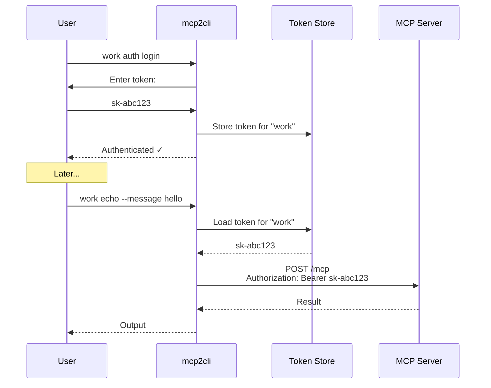

# Authentication

Manage server authentication with token persistence, interactive login, and automatic header injection.

---

## Commands

```bash
# Interactive login — prompts for token
work auth login

# Check current state
work auth status

# Clear stored credentials
work auth logout
```

---

## How It Works



---

## Token Storage

Tokens are persisted per-config at:

```
~/.local/share/mcp2cli/instances/<name>/tokens.json
```

The file contains:

```json
{
  "bearer_token": "sk-abc123"
}
```

### Custom Token Path

Override the default location:

```yaml
auth:
  token_store_file: /secure/path/tokens.json
```

---

## Auth States

| State | Meaning |
|-------|---------|
| `unauthenticated` | No token stored |
| `active` | Token stored and being sent with requests |

Check the current state:

```bash
work auth status
# → Auth state: active

work --json auth status | jq '.data.auth_session.state'
# → "active"
```

---

## Transport Behavior

| Transport | Auth Support | How |
|-----------|-------------|-----|
| Streamable HTTP | ✅ | `Authorization: Bearer <token>` header on all requests |
| Stdio | ❌ | Subprocess inherits environment; set env vars in config |
| Demo | ❌ | No auth needed |

For stdio servers that need authentication, pass credentials via environment:

```yaml
server:
  transport: stdio
  stdio:
    command: my-server
    env:
      API_KEY: sk-abc123
```

---

## Browser-Based OAuth

For servers that support OAuth browser flows:

```yaml
auth:
  browser_open_command: "xdg-open"    # Linux
  # browser_open_command: "open"      # macOS
```

When the server sends an `elicitation/create` with a URL during auth, mcp2cli opens the browser automatically.

---

## See Also

- [Configuration Reference](../reference/config-reference.md) — auth config fields
- [Elicitation & Sampling](elicitation-and-sampling.md) — interactive auth flows
