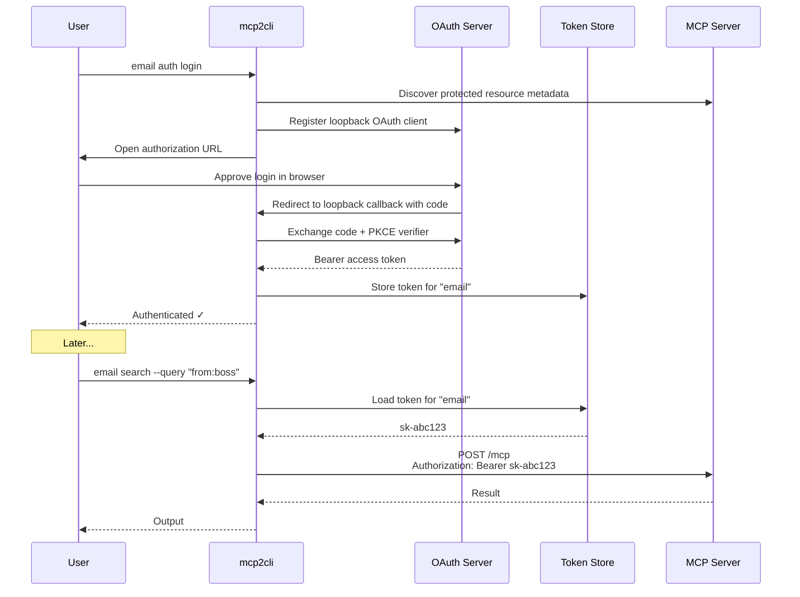

# Authentication

Manage server authentication with token persistence, interactive login, and automatic header injection.

---

## Commands

```bash
# Login — starts browser OAuth for HTTP servers that advertise it
email auth login

# Login with an existing bearer token
echo "$TOKEN" | email auth login

# Login non-interactively with an existing bearer token
echo "$TOKEN" | email auth login --non-interactive

# Login with a structured payload
email auth login --input-json '{"bearer_token": "sk-abc123", "account": "me@example.com"}'

# Check current state
email auth status

# Clear stored credentials
email auth logout
```

`auth login` resolves credentials in this order:

1. **Piped stdin** — `echo "$TOKEN" | email auth login`.
2. **`--input-json`** — a JSON object with the schema below.
3. **Browser OAuth** — for streamable-HTTP configs, mcp2cli discovers the server's OAuth metadata, dynamically registers a loopback client, starts authorization-code + PKCE, and stores the returned access token.

Pass `--non-interactive` to fail fast when no token is supplied via stdin or `--input-json`.

### `--input-json` schema

```json
{
  "bearer_token": "<token>",
  "account": "<optional>"
}
```

| Field | Required | Meaning |
|-------|----------|---------|
| `bearer_token` | ✅ | The token sent as `Authorization: Bearer <token>`. |
| `account` | — | Optional account label stored alongside the token. |

---

## How It Works


```mermaid
sequenceDiagram
    participant User
    participant CLI as mcp2cli
    participant Auth as OAuth Server
    participant Store as Token Store
    participant Server as MCP Server

    User->>CLI: email auth login
    CLI->>Server: Discover protected resource metadata
    CLI->>Auth: Register loopback OAuth client
    CLI->>User: Open authorization URL
    User->>Auth: Approve login in browser
    Auth->>CLI: Redirect to loopback callback with code
    CLI->>Auth: Exchange code + PKCE verifier
    Auth-->>CLI: Bearer access token
    CLI->>Store: Store token for "email"
    CLI-->>User: Authenticated ✓

    Note over User: Later...

    User->>CLI: email search --query "from:boss"
    CLI->>Store: Load token for "email"
    Store-->>CLI: sk-abc123
    CLI->>Server: POST /mcp<br/>Authorization: Bearer sk-abc123
    Server-->>CLI: Result
    CLI-->>User: Output
```

---

## Token Storage

Tokens are persisted per-config at:

```text
~/.local/share/mcp2cli/instances/<name>/tokens.json
```

The file is written with `0600` permissions (owner read/write only) and contains:

```json
{
  "bearer_token": "sk-abc123"
}
```

### Custom Token Path

Override the default location:

```yaml
auth:
  token_store_file: /secure/path/tokens.json
```

---

## Auth States

| State | Meaning |
|-------|---------|
| `unauthenticated` | No token stored |
| `active` | Token stored and being sent with requests |

Check the current state:

```bash
email auth status
# → Auth state: active

email --json auth status | jq '.data.auth_session.state'
# → "active"
```

---

## Transport Behavior

| Transport | Auth Support | How |
|-----------|-------------|-----|
| Streamable HTTP | ✅ | `Authorization: Bearer <token>` injected on every request from the stored token |
| Stdio | ❌ | Subprocess inherits environment; set env vars in config |
| Demo | ❌ | No auth needed |

The streamable-HTTP transport loads the stored token and attaches an
`Authorization: Bearer <token>` header to every request automatically — no
per-call flags needed. Both `http` and `https` endpoints are supported; HTTPS
connections use TLS via `rustls` with the `webpki` root certificates, so a
production endpoint like `https://mcp.example.com/email` works out of the box.

For stdio servers that need authentication, pass credentials via environment:

```yaml
server:
  transport: stdio
  stdio:
    command: my-server
    env:
      API_KEY: sk-abc123
```

---

## Browser-Based OAuth

For streamable-HTTP servers that implement MCP OAuth discovery and dynamic
client registration:

```yaml
auth:
  browser_open_command: "xdg-open"    # Linux
  # browser_open_command: "open"      # macOS
```

`auth login` discovers `/.well-known/oauth-protected-resource`, reads the
authorization server metadata, dynamically registers a loopback redirect URI,
opens the authorization URL, and stores the resulting bearer token. The
authorization request includes the MCP `resource` parameter and uses PKCE S256.

If you already have a bearer token, pipe it or pass `--input-json`; this bypasses
browser OAuth and stores the token directly.

---

## See Also

- [Configuration Reference](../reference/config-reference.md) — auth config fields
- [Elicitation & Sampling](elicitation-and-sampling.md) — interactive auth flows
