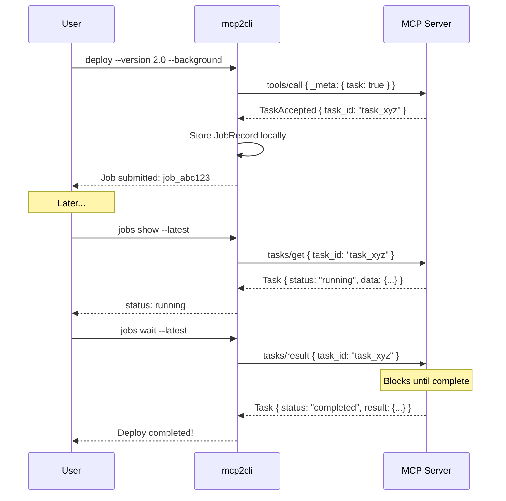
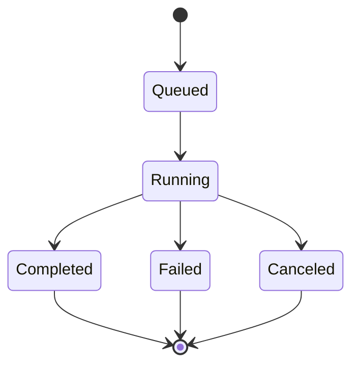

# Background Jobs & Task System

Run long-running MCP operations in the background and manage them with `jobs` commands.

---

## Overview

Some MCP tools take minutes or hours to complete — data exports, deployments, batch processing. Instead of blocking your terminal, use `--background` to submit the operation and get a job ID back immediately.

```bash
# Submit a background job
work deploy --version 2.0 --background
# → Job submitted: job_abc123 (task: task_xyz789)

# Check status
work jobs show --latest
# → status: running, remote status: running

# Wait for completion
work jobs wait --latest
# → status: completed, result: { ... }
```

---

## The `--background` Flag

Any tool command supports `--background`:

```bash
work deploy --version 2.0 --background
work export --dataset full --format parquet --background
work batch-process --input data.csv --background
```

When `--background` is used:

1. The request includes `_meta.task` to signal task augmentation
2. If the server supports tasks, it returns a `TaskAccepted` response with a `task_id`
3. mcp2cli creates a local job record linking the operation to the remote task
4. The command returns immediately

---

## Job Management

### List Jobs

```bash
work jobs list
```

```
job_abc123  deploy       running   task_xyz789  2026-03-30T10:15:30Z
job_def456  export       completed task_uvw012  2026-03-30T09:30:00Z
```

### Show Job Details

```bash
# By ID
work jobs show job_abc123

# Latest job
work jobs show --latest
```

### Wait for Completion

Block until the job finishes:

```bash
work jobs wait job_abc123
work jobs wait --latest
```

### Cancel a Job

```bash
work jobs cancel job_abc123
work jobs cancel --latest
```

### Watch Job Progress

Stream real-time progress events:

```bash
work jobs watch job_abc123
work jobs watch --latest
```

---

## How It Works



---

## Task Protocol

The background jobs system uses the MCP task protocol:

| MCP Method | CLI Command | Purpose |
|------------|-------------|---------|
| `tasks/get` | `jobs show` | Get current task status |
| `tasks/result` | `jobs wait` | Block until task completes |
| `tasks/cancel` | `jobs cancel` | Request task cancellation |

### Task States



| State | Meaning |
|-------|---------|
| `queued` | Server accepted the task, not yet started |
| `running` | Task is actively executing |
| `completed` | Task finished successfully |
| `failed` | Task encountered an error |
| `canceled` | Task was canceled by the client |

---

## Job Records

Jobs are persisted to disk at `instances/<name>/jobs/`. Each job record contains:

- **job_id** — local identifier
- **remote_task_id** — server-assigned task ID
- **capability** — the tool that was called
- **arguments** — the arguments used
- **status** — current local status
- **timestamps** — creation and update times

---

## JSON Output

All jobs commands support structured output:

```bash
work --json jobs list | jq '.[].status'
work --json jobs show --latest | jq '.data.remote'
work --json jobs wait --latest | jq '.data.result'
```

---

## Practical Examples

### CI/CD Deployment Pipeline

```bash
#!/bin/bash
set -e

# Submit deployment
RESULT=$(work --json deploy --version "$VERSION" --background)
JOB_ID=$(echo "$RESULT" | jq -r '.data.job_id')

echo "Deployment submitted: $JOB_ID"

# Wait for completion with timeout
if ! timeout 600 work jobs wait "$JOB_ID"; then
  echo "Deployment timed out"
  work jobs cancel "$JOB_ID"
  exit 1
fi

echo "Deployment complete"
```

### Parallel Background Operations

```bash
# Submit multiple jobs
work export --dataset users --background
work export --dataset orders --background
work export --dataset analytics --background

# Monitor all
work jobs list
```

---

## Server Requirements

The background jobs system requires the MCP server to:

1. Support the `tasks` capability
2. Return `TaskAccepted` responses when `_meta.task` is present
3. Implement `tasks/get`, `tasks/result`, and `tasks/cancel` methods

If the server doesn't support tasks, `--background` falls back to synchronous execution with a local job wrapper.

---

## See Also

- [Request Timeouts](request-timeouts.md) — for operations that should fail-fast rather than run in background
- [Event System](event-system.md) — `job_update` events for monitoring
- [CLI Reference](../reference/cli-reference.md) — full `jobs` subcommand syntax
