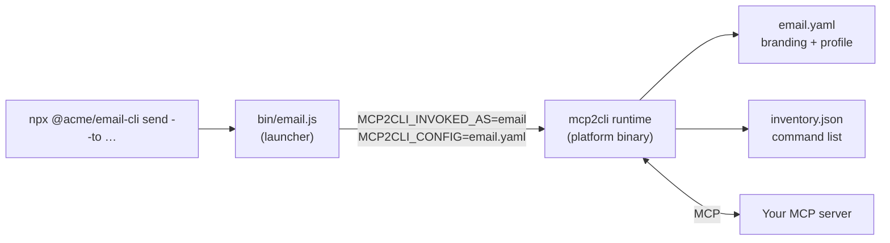
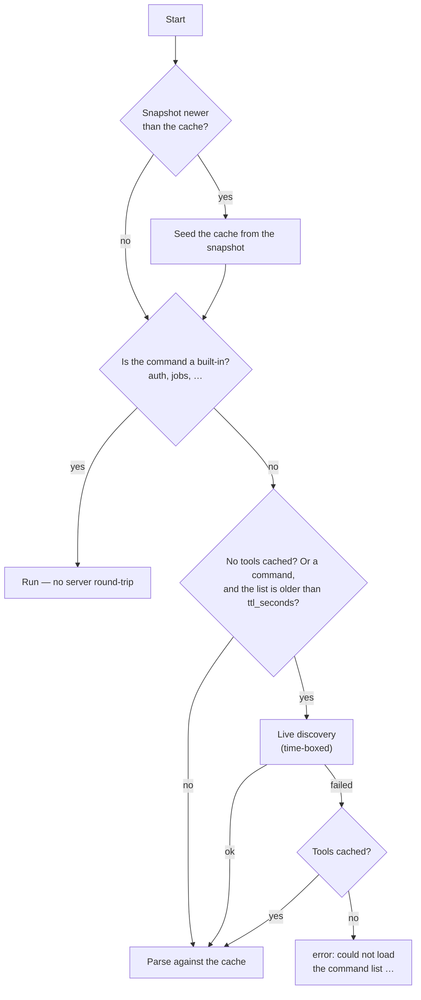

# Branded CLI

Publish an MCP server as a command-line application under **its own name** — `email`, not `mcp2cli email` — that someone can install with `npm install -g` or run with `npx`, with a `--help` that shows nothing but your commands.

This page is the reference. For the walkthrough, start with [Ship Your MCP Server as a CLI](../articles/ship-mcp-server-as-cli.md).

---

## Overview

An mcp2cli [alias](named-configs-and-aliases.md) is personal: it needs mcp2cli installed, a config in the user's config directory, a symlink, and a first discovery before its commands exist. A **branded CLI** is the same binding made distributable. It consists of three files:

| File | Role |
|------|------|
| `email.yaml` | The server binding, plus a `branding:` section that gives the CLI its own identity |
| `inventory.json` | A snapshot of the server's tools, resources and prompts, so commands exist on first run |
| a launcher | Starts the mcp2cli runtime as `email`, bound to the two files above |



`mcp2cli package init` generates all three. Nothing in the result requires the user to know mcp2cli exists.

---

## Embedded mode

The presence of a `branding:` section switches the runtime into **embedded mode**. Every item below changes together — there is no partial state where some of mcp2cli shows through.

| Aspect | mcp2cli alias | Branded CLI |
|--------|---------------|-------------|
| Help header | `<server> — powered by mcp2cli` | `branding.about` |
| `--version` | mcp2cli's version, config, transport | `<name> <branding.version>` — one line |
| `--url` / `--stdio` ad-hoc flags | select another server | not recognized — free for a tool's own `--url` flag |
| Built-in commands | all (`auth`, `jobs`, `doctor`, `ls`, …) | only those in `branding.builtin_commands` |
| Generic commands (`tool call`, `invoke`, …) | available | removed unless listed |
| `--background` flag on tools | always | only when `jobs` is exposed |
| OAuth consent screen | `mcp2cli <config>` | `branding.name` |
| MCP `clientInfo` sent to the server | `mcp2cli` + its version | `branding.name` + `branding.version` |
| State and tokens | `~/.local/share/mcp2cli/` | `~/.local/share/<name>/` |
| mcp2cli usage telemetry | on (opt-out) | **off** unless `telemetry.enabled: true` is set |
| First run without a cache | — | always the dynamic surface, never the generic one |

The data directory follows the platform convention: `~/.local/share/<name>` on Linux (or `$XDG_DATA_HOME/<name>`), `~/Library/Application Support/<name>` on macOS. A user who already has an mcp2cli config called `email` shares nothing with your `email` CLI — not the cache, not the tokens.

That separation is a security property, not tidiness: tokens are stored per config name, and a published CLI picks its own name *and* its own endpoint. So `MCP2CLI_DATA_DIR` relocates a branded CLI's data but never merges it — with the variable set, the directory is `$MCP2CLI_DATA_DIR/apps/<name>`.

---

## `branding`

```yaml
branding:
  name: email
  about: Send and search Acme Mail from your terminal
  version: 1.4.0
  builtin_commands: [auth]
  after_help: |
    Docs:    https://acme.example/mail-cli
    Support: support@acme.example
```

| Field | Type | Default | Description |
|-------|------|---------|-------------|
| `name` | string | the invoked name | Product name. Names the data directory, and identifies the CLI on the OAuth consent screen and in the MCP `clientInfo`. Letters, digits, `-`, `_`, `.` |
| `about` | string | `server.display_name` | One-line description at the top of `--help` |
| `version` | string | mcp2cli's version | What `--version` prints. The npm launcher passes the package's own version, so leave it unset there. Quote it in YAML: an unquoted `1.0` is a number and is rejected |
| `after_help` | string | — | Free text after the top-level help: examples, links |
| `builtin_commands` | list | all | Built-in commands to expose. `[]` exposes none |
| `attribution` | bool | `false` | Append ` — powered by mcp2cli` to the help header |

### Built-in commands

`builtin_commands` is an allowlist over everything the runtime adds on top of your server's commands:

| Command | What it does | Expose it when |
|---------|--------------|----------------|
| `auth` | `login`, `logout`, `status` | The server requires authentication |
| `jobs` | List, wait on, cancel background jobs | Tools run long enough to want `--background` |
| `ls` | List tools, resources, prompts; refresh the command list | Users should be able to refresh without a new release |
| `doctor`, `inspect`, `ping` | Connectivity and capability diagnostics | You want users to self-diagnose before filing a ticket |
| `log` | Set the server's log level | Rarely |
| `complete` | Server-side completions | You build shell completion on top of it |
| `subscribe`, `unsubscribe` | Resource change notifications | The server supports subscriptions |
| `tool`, `resource`, `prompt` | Generic `tool call <name>`, `resource read <uri>`, `prompt run <name>` | Scripts should be able to call capabilities by their raw MCP name |

Omitting the field exposes all of them; listing some exposes exactly those. The allowlist is enforced by both parsers, so an unlisted command is a plain `unrecognized subcommand` — and its name becomes available to a server tool of the same name (a tool called `ls` is reachable once the built-in `ls` is not listed).

mcp2cli's legacy aliases (`invoke`, `read`, `list`, `discover`) are never part of a listed surface.

### What branding does not change

- **Global options** — `--json`, `--output`, `--timeout`, `--non-interactive`, `--input-json` stay. They are ordinary CLI options and scripts rely on them.
- **Progress lines** — `[email] invoking capability …` on stderr is controlled by `events.enable_stdio_events`, not by branding. `package init` sets it to `false`; set it yourself in a hand-written config.
- **Command names and flags** — shaping those is the job of the [profile overlay](profile-overlays.md), which works unchanged in a branded CLI.

---

## `discovery`

The dynamic CLI is built from a discovery inventory. On a user's machine that inventory does not exist yet, which is why a branded CLI ships one.

```yaml
discovery:
  snapshot: inventory.json
  ttl_seconds: 86400
```

| Field | Type | Default | Description |
|-------|------|---------|-------------|
| `auto` | bool | `true` | Discover on demand when nothing is cached. Applies to every mcp2cli config, not only branded ones |
| `snapshot` | path | — | Inventory snapshot, relative to the config file |
| `ttl_seconds` | integer | — | Before running a command, re-discover if the list is older than this. A failed refresh silently keeps the stale list. Never applies to `--help` |

Before each run the runtime reconciles three sources:



Three rules keep discovery from getting in the way:

- **It is time-boxed.** An on-demand discovery gets 10 seconds on the way to `--help` and 30 on the way to a command — not the operation timeout, which defaults to 120 seconds per request. `--timeout` overrides the budget, and a shorter `defaults.timeout_seconds` caps it.
- **Each snapshot seeds once.** After a live discovery has replaced the snapshot's list, the same snapshot never overwrites it again, whatever the two machines' clocks say.
- **A failed tool listing is not "no tools".** If the server advertises tools but `tools/list` fails, nothing is cached for tools and the next run asks again. A category the server does not advertise at all is cached as empty.

Why the snapshot matters more than auto-discovery for a published CLI:

- **Before login.** A protected server cannot be asked for its tools until the user has authenticated — and the first thing a new user runs is `--help`. The snapshot answers it.
- **Offline and instant.** `--help` and argument validation cost no network round-trip.
- **Stable.** The command list a release documents is the one its users get.

A snapshot never beats fresher data: it seeds the cache only while it is the newer of the two. After a user runs `ls` (if exposed), or `ttl_seconds` triggers a refresh, the live list wins until you publish a newer snapshot.

If a snapshot is missing or unreadable, the CLI carries on as if it had none and discovers on demand; the reason is logged at `debug` level.

When there is no command list at all and discovery fails, the error says so instead of blaming the user's typing:

```text
error: could not load the command list from Acme Mail: streamable HTTP request failed: client error (Connect)

If the server requires authentication, run `email auth login` first.
```

Built-ins never wait on discovery, so `email auth login` works in exactly that situation.

### Refreshing a snapshot

```bash
mcp2cli package snapshot --config email.yaml --out inventory.json
```

This discovers against the live server using the packaged config — and therefore the credentials of your own `email auth login`. If the server cannot be reached, it falls back to the inventory already cached for that config. The generated `package.json` wires the same command to `npm run snapshot`.

---

## `mcp2cli package`

### `package init`

```bash
mcp2cli package init --name email \
  --package-name @acme/email-cli \
  --about "Send and search Acme Mail from your terminal"
```

| Option | Default | Description |
|--------|---------|-------------|
| `--name <NAME>` | required | Command name of the published CLI |
| `--from <CONFIG>` | `--name` | Named mcp2cli config to package |
| `--config <FILE>` | — | Package a config file instead of a named config |
| `--out <DIR>` | `./<name>-cli` | Output directory |
| `--target <npm\|shell>` | `npm` | Launcher to generate |
| `--package-name <NAME>` | `--name` | Published package name, e.g. a scoped npm name |
| `--package-version <V>` | `0.1.0` | Version of the published package |
| `--about <TEXT>` | `server.display_name` | Help header |
| `--builtin <COMMAND>` | `auth` for HTTP, none for stdio | Built-in to expose; repeatable |
| `--no-builtins` | — | Expose no built-ins |
| `--no-snapshot` | — | Do not bundle a snapshot |
| `--force` | — | Write into a non-empty directory |

The generated config carries over `server`, `defaults.timeout_seconds` and your `profile`. A package is public, so everything tied to your machine is left out: the token store path, logging outputs, event sinks — and, for a stdio server, `server.stdio.env` and `server.stdio.cwd`. Environment values are where API keys live; they are never copied, and the output lists the variable names in a `warning:` so you can decide what users need to provide. Absolute paths in the stdio `command` or `args` are copied as written and warned about, since they will not exist on a user's machine.

If the server is unreachable while scaffolding, the package is still written, without a snapshot, and the output says why. Run `package snapshot` once the server is back.

`mcp2cli` and names starting with `mcp-` are reserved and rejected as CLI names.

### `package snapshot`

```bash
mcp2cli package snapshot [--from <CONFIG> | --config <FILE>] [--out inventory.json]
```

---

## Targets

### `npm`

```text
email-cli/
├── package.json      bin: { "email": "bin/email.js" }, depends on "mcp2cli"
├── bin/email.js      the launcher
├── email.yaml        server binding + branding + profile
├── inventory.json    command list snapshot
└── README.md
```

The launcher is five lines:

```js
#!/usr/bin/env node
const path = require("node:path");
const { run } = require("mcp2cli");
const pkg = require("../package.json");

run({ name: "email", config: path.join(__dirname, "..", "email.yaml"), version: pkg.version });
```

The [`mcp2cli`](https://www.npmjs.com/package/mcp2cli) npm package resolves the native runtime. It carries no binary itself: the binaries live in `@mcp2cli/linux-x64`, `@mcp2cli/linux-arm64`, `@mcp2cli/darwin-x64` and `@mcp2cli/darwin-arm64`, each marked with `os`/`cpu` and listed as an optional dependency, so npm installs exactly one. There is no postinstall script and no download at install time — it works behind a proxy and in locked-down CI.

The Linux binaries are statically linked (musl), so they run on every distribution, including Alpine and hosts with an old glibc.

| `run()` option | Description |
|----------------|-------------|
| `name` | Command name the CLI presents itself as |
| `config` | Path to the config file |
| `version` | Reported by `--version`; pass your `package.json` version |
| `args` | Defaults to `process.argv.slice(2)` |
| `env` | Extra environment variables for the runtime |

`run()` inherits stdio, forwards `SIGINT`/`SIGTERM`/`SIGHUP`, and exits with the runtime's status. `binaryPath()` returns the binary's location if you would rather spawn it yourself. `MCP2CLI_BINARY` overrides the lookup — useful on a platform without a prebuilt binary.

### `shell`

```text
email-cli/
├── bin/email         POSIX sh launcher
├── email.yaml
├── inventory.json
└── README.md
```

For everything that installs files and already has `mcp2cli` on `PATH`: a Homebrew formula, a tarball, a layer in a container image. The script resolves symlinks to find its own directory, so `ln -s …/email-cli/bin/email /usr/local/bin/email` works.

### Writing your own launcher

A launcher only has to set two environment variables and execute the binary:

```bash
MCP2CLI_INVOKED_AS=email MCP2CLI_CONFIG=/opt/email/email.yaml exec mcp2cli "$@"
```

| Variable | Description |
|----------|-------------|
| `MCP2CLI_INVOKED_AS` | The command name. Replaces what mcp2cli would read from `argv[0]`, so no symlink or process rename is needed |
| `MCP2CLI_CONFIG` | Path to the config file |
| `MCP2CLI_BRANDING__VERSION` | Overrides `branding.version`, taken verbatim (`1.10` stays `1.10`) |
| `MCP2CLI_DATA_DIR` | Relocates the data directory to `<dir>/apps/<name>` |

In launcher mode — `MCP2CLI_INVOKED_AS` set — a `--config` in the user's arguments does not replace `MCP2CLI_CONFIG`. The runtime also removes these variables from the environment of anything it starts (a stdio server, an event command), so a child that itself uses mcp2cli does not wake up as your CLI.

That is the whole contract, which makes other ecosystems straightforward: a Python `console_scripts` entry point, a Go wrapper, a Docker `ENTRYPOINT`.

---

## Best practices

1. **Shape the surface with a profile first.** A branded help screen is only as good as the command names in it. Rename, group and hide with the [profile overlay](profile-overlays.md), check the result with your own alias, then package.
2. **Expose `auth` and little else.** Every built-in you list is a command you now document and support. Add `jobs` if tools are slow, `ls` if the server changes faster than you release.
3. **Ship a snapshot, and refresh it in your release process.** `npm run snapshot` before `npm publish` keeps the documented command list and the shipped one identical.
4. **Set `ttl_seconds` if the server evolves independently of the CLI** — a day is a reasonable start. It costs one extra round-trip on the first command after the list expires, and nothing on `--help`. Without it, users keep the list from the snapshot until your next release.
5. **Keep `attribution` off or on deliberately.** It is off by default; turning it on is a courtesy, not a requirement.

---

## See Also

- [Ship Your MCP Server as a CLI](../articles/ship-mcp-server-as-cli.md) — the end-to-end walkthrough, including login
- [Profile Overlays](profile-overlays.md) — command names, groups and flags
- [Authentication](authentication.md) — what `auth login` does
- [Discovery-Driven CLI](discovery-driven-cli.md) — how tools become commands
- [Configuration Reference](../reference/config-reference.md) — every config field
