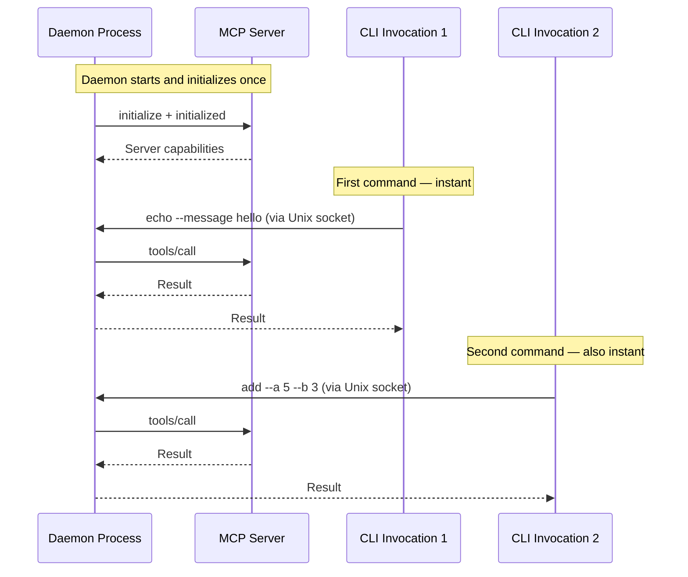

# Daemon Mode

Keep MCP connections warm between CLI invocations. Eliminate server startup overhead for stdio subprocesses and reduce latency for HTTP connections.

---

## The Problem

Without a daemon, every mcp2cli command:

1. Starts a fresh process
2. Reads config
3. Spawns a subprocess (stdio) or opens an HTTP connection
4. Sends `initialize` + `initialized`
5. Performs the actual operation
6. Tears everything down

For stdio servers especially, steps 2–4 can take **1–5 seconds** — unacceptable for interactive use or tight automation loops.

---

## The Solution

The daemon holds the MCP connection open as a background process. CLI invocations detect the running daemon and route requests through a Unix socket — skipping initialization entirely.



---

## Usage

### Start a Daemon

```bash
mcp2cli daemon start my-server
```

This:
1. Loads the named config `my-server`
2. Forks a background process
3. Initializes the MCP connection (with a ping)
4. Writes a PID file and creates a Unix socket
5. Returns immediately — the daemon runs in the background

### Check Status

```bash
# Status for a specific config
mcp2cli daemon status my-server

# Status for all configs
mcp2cli daemon status
```

Output:

```
my-server: running (pid 12345, socket /home/user/.local/share/mcp2cli/instances/my-server/daemon.sock)
other-server: not running
```

### Stop a Daemon

```bash
mcp2cli daemon stop my-server
```

Sends SIGTERM to the daemon process and cleans up the PID file and socket.

---

## Automatic Detection

You don't need to change your commands. When a daemon is running, mcp2cli **automatically detects it** and routes requests through the socket:

```bash
# Without daemon: spawns subprocess, initializes, calls tool, tears down
work echo --message hello    # ~2s

# Start daemon
mcp2cli daemon start work

# With daemon: connects to socket, calls tool, done
work echo --message hello    # ~50ms
```

The detection happens in `build_client()`:
1. Check if `instances/<name>/daemon.json` exists
2. Verify the PID is still alive
3. Verify the Unix socket exists
4. If all checks pass → use `DaemonMcpClient` instead of direct transport

---

## Daemon Protocol

The daemon communicates over a Unix socket using a simple newline-delimited JSON protocol:

```
Client → Daemon:  {"InvokeAction":{"capability":"echo","arguments":{"message":"hello"},"background":false}}\n
Daemon → Client:  {"Action":{"message":"...","capability":"echo","content":[...],"data":{...}}}\n
```

Each request is one line of JSON (a serialized `McpOperation`), and the response is one line of JSON (a serialized `McpOperationResult` or error envelope).

---

## File Layout

| File | Purpose |
|------|---------|
| `instances/<name>/daemon.json` | PID file with process metadata |
| `instances/<name>/daemon.sock` | Unix domain socket for IPC |

### PID File Format

```json
{
  "pid": 12345,
  "config_name": "work",
  "socket_path": "/home/user/.local/share/mcp2cli/instances/work/daemon.sock",
  "started_at": "2026-03-30T10:15:30Z"
}
```

---

## Graceful Shutdown

The daemon handles:
- **SIGTERM** — graceful shutdown, cleans up PID file and socket
- **SIGINT (Ctrl+C)** — same as SIGTERM
- **Stale detection** — if the PID file exists but the process is dead, mcp2cli cleans up automatically

---

## Foreground Mode

For debugging, run the daemon in the foreground:

```bash
MCP2CLI_DAEMON_FOREGROUND=1 mcp2cli daemon start work
```

This keeps the process attached to your terminal with full log output.

---

## Practical Examples

### Development Workflow

```bash
# Start daemon for your dev server
mcp2cli daemon start dev

# Rapid iteration — each call is instant
dev echo --message test1
dev echo --message test2
dev deploy --version 1.0

# Done for the day
mcp2cli daemon stop dev
```

### Multiple Daemons

```bash
mcp2cli daemon start dev
mcp2cli daemon start staging
mcp2cli daemon start prod

# Each alias auto-routes to its daemon
dev ls
staging ls
prod ls

# Check all
mcp2cli daemon status
```

### CI/CD with Warm Connections

```bash
# Start of pipeline
mcp2cli daemon start ci-server

# Run multiple commands without re-init overhead
work --json ls | jq '.data.items | length'
work echo --message "smoke-test"
work --json doctor | jq '.data.server'

# End of pipeline
mcp2cli daemon stop ci-server
```

---

## Limitations

- Unix-only (requires Unix domain sockets)
- No ad-hoc connections (daemon requires a named config)
- One daemon per config name
- The daemon does not auto-restart if the underlying MCP server crashes

---

## See Also

- [Transports](transports.md) — understand what the daemon keeps warm
- [Request Timeouts](request-timeouts.md) — timeouts still apply through the daemon
- [Named Configs & Aliases](named-configs-and-aliases.md) — daemon requires named configs
