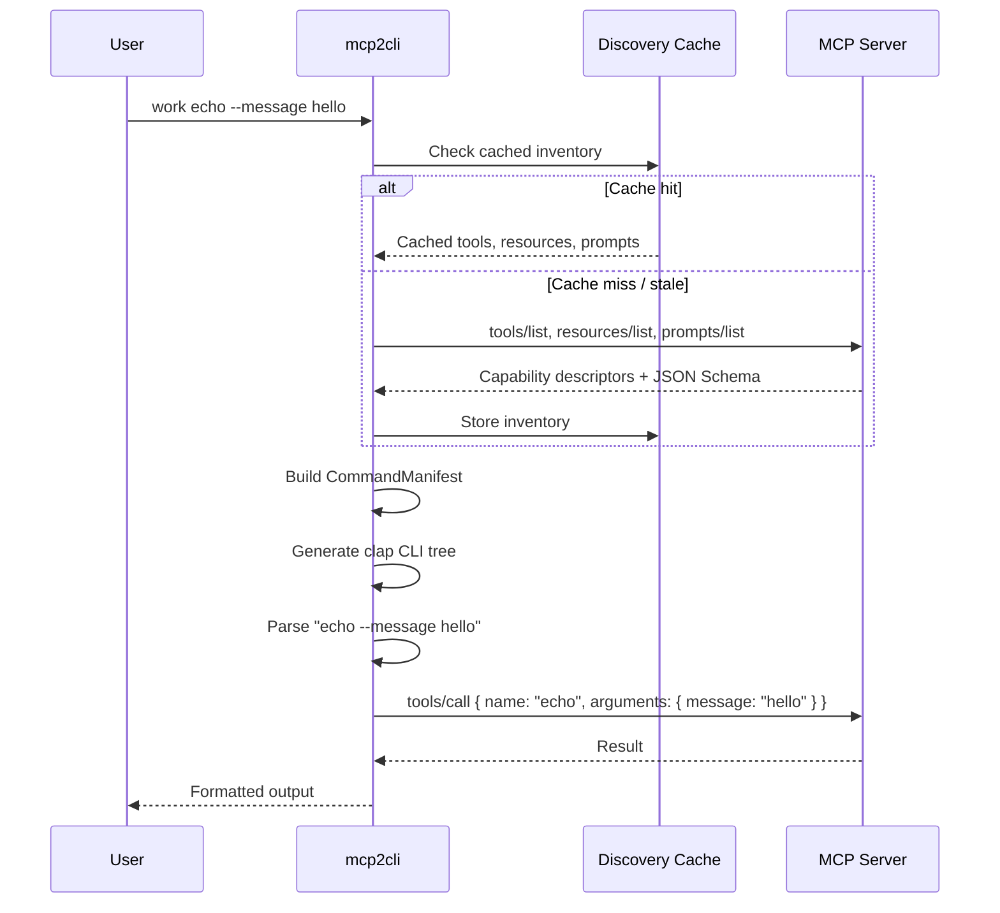
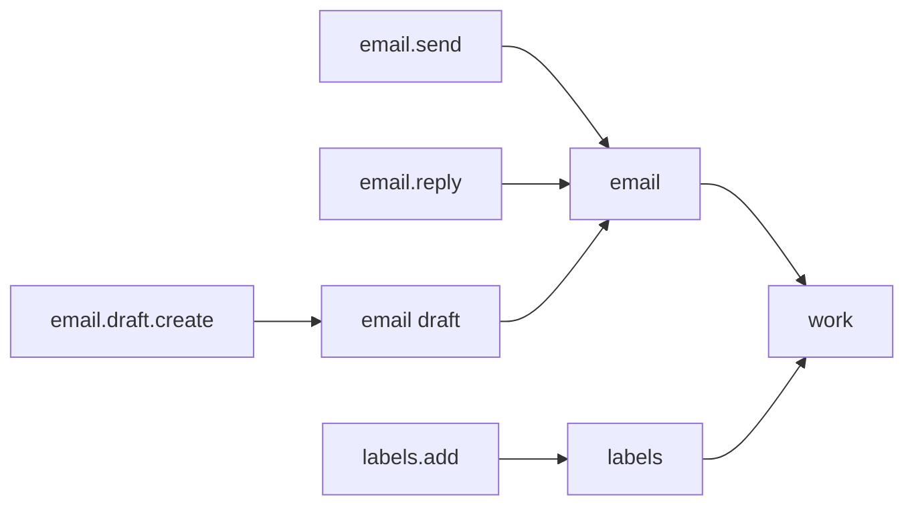

# Discovery-Driven CLI

The core innovation of mcp2cli: server capabilities are auto-discovered and transformed into real, typed CLI commands with no manual wiring.

---

## How It Works



---

## The Command Manifest

When mcp2cli discovers a server's capabilities, it builds a **CommandManifest** — a typed command tree where:

- **Tools** → become verb commands (e.g., `echo`, `deploy`, `add`)
- **Prompts** → become workflow commands (e.g., `simple-prompt`, `code-review`)
- **Resources** → `get <URI>` for direct resource reads
- **Resource Templates** → parameterized commands with typed flags

### Schema-to-Flag Mapping

Tool `inputSchema` and prompt `arguments` are converted to real CLI flags:

| JSON Schema Type | CLI Flag Type | Example |
|-----------------|---------------|---------|
| `string` | `--name <TEXT>` | `--message "hello"` |
| `integer` | `--count <INT>` | `--steps 5` |
| `number` | `--rate <NUM>` | `--temperature 0.7` |
| `boolean` | `--flag` (no value) | `--include-image` |
| `enum` | `--kind <A\|B\|C>` | `--level error` |
| `array` | `--items <VAL,...>` | `--tags bug,urgent` |
| Complex object | `--config <JSON>` | `--config '{"a":1}'` |

**Required** fields become required flags. **Defaults** from JSON Schema are applied when flags are omitted.

---

## Namespace Grouping

Dotted tool names automatically become nested subcommands:

```
Server tools:
  email.send
  email.reply
  email.draft.create
  labels.add

CLI becomes:
  work email send --to user@example.com --body "Hello"
  work email reply --thread-id 123 --body "Thanks"
  work email draft create --subject "New draft"
  work labels add --name urgent --color red
```



---

## Resource Templates as Commands

URI templates like `user://profile/{user_id}` become parameterized commands:

```bash
# Single parameter → positional argument
work mail-search "invoices 2026"

# Multiple parameters → typed flags
work user-profile --user-id 42 --format json
```

---

## Discovery Cache & Offline Mode

Discovery results are cached in `~/.local/share/mcp2cli/instances/<name>/discovery.json`. This means:

1. **First run:** Live discovery from server → cache stored
2. **Subsequent runs:** Instant startup from cache
3. **Offline:** Commands still work from cache
4. **Cache invalidation:** When the server sends `notifications/tools/list_changed` (or similar), a stale marker is written. Next `ls` triggers live re-discovery.

Force a live re-discovery:

```bash
work ls    # Uses cache if fresh; re-discovers if stale
```

---

## Runtime Commands

These are always available alongside discovered commands — no server schema needed:

| Command | Purpose |
|---------|---------|
| `ls` | List all capabilities (with `--tools`, `--resources`, `--prompts`, `--filter`) |
| `ping` | Server liveness check with latency measurement |
| `log <LEVEL>` | Set server-side log verbosity |
| `complete <ref> <name> <arg> [value]` | Request tab-completions from server |
| `subscribe <URI>` | Subscribe to resource change notifications |
| `unsubscribe <URI>` | Unsubscribe from resource notifications |
| `auth login/logout/status` | Authentication management |
| `jobs list/show/wait/cancel/watch` | Background job management |
| `doctor` | Runtime health diagnostics |
| `inspect` | Full server capability dump |

---

## Static vs. Dynamic CLI

mcp2cli has two parsing layers:

1. **Dynamic CLI** (primary) — generated from the cached command manifest. This is what users interact with.
2. **Static Bridge CLI** (fallback) — a backward-compatible `tool call`, `resource read`, `prompt run` surface used when the dynamic CLI cannot parse input.

The dynamic CLI is always tried first. If it fails, the static bridge catches the command.

---

## See Also

- [Profile Overlays](profile-overlays.md) — customize the generated CLI surface
- [Fuzzy Matching](fuzzy-matching.md) — typo correction for discovered commands
- [CLI Reference](../reference/cli-reference.md) — full command listing
