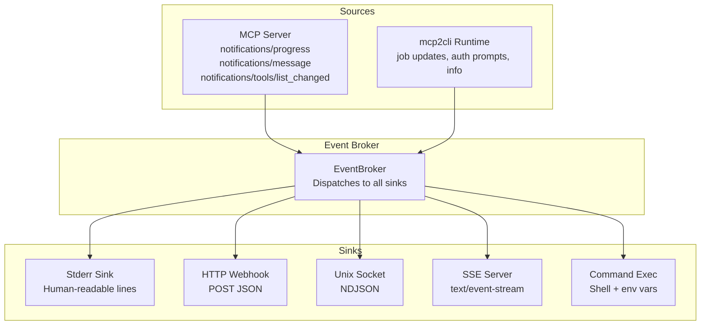

# Event System

mcp2cli delivers runtime events (progress, server logs, job updates, auth prompts) through configurable sinks — stderr, HTTP webhooks, Unix sockets, SSE, or custom commands.

---

## Event Types

| Type | Trigger | Content |
|------|---------|---------|
| `info` | General runtime messages | Human-readable message |
| `progress` | Server sends `notifications/progress` | Progress percentage, message |
| `server_log` | Server sends `notifications/message` | Log level + message |
| `job_update` | Background job state changes | Job ID, status, details |
| `auth_prompt` | Auth flow requires user input | Prompt message |
| `list_changed` | Server capabilities changed | Category (tools/resources/prompts) |

---

## Sink Configuration

Configure event sinks in your config YAML. Multiple sinks can be active simultaneously:

```yaml
events:
  enable_stdio_events: true                              # stderr (default: on)
  http_endpoint: "http://127.0.0.1:9090/events"         # HTTP webhook
  local_socket_path: "/tmp/mcp2cli-events.sock"         # Unix socket
  sse_endpoint: "127.0.0.1:9091"                        # SSE server
  command: "logger -t mcp2cli '${MCP_EVENT_MESSAGE}'"   # Shell command
```

---

## Sink Types

### Stderr (Default)

Human-readable event lines on stderr. Always on unless disabled.

```yaml
events:
  enable_stdio_events: true    # true by default
```

Output:

```json
[progress] Deploying: 45% complete
[server_log] INFO: Connection pool warmed up
[info] Discovery cache refreshed (14 capabilities)
```

### HTTP Webhook

POST JSON events to an HTTP endpoint:

```yaml
events:
  http_endpoint: "http://127.0.0.1:9090/events"
```

Payload:

```json
{
  "type": "progress",
  "app_id": "work",
  "message": "Deploying: 45% complete",
  "data": {
    "progress": 0.45,
    "total": 1.0
  }
}
```

Use cases: monitoring dashboards, alerting systems, audit logs.

### Unix Domain Socket

NDJSON events written to a Unix socket:

```yaml
events:
  local_socket_path: "/tmp/mcp2cli-events.sock"
```

Each event is one JSON line:

```json
{"type":"progress","app_id":"work","message":"Deploying: 45%","data":{}}
{"type":"info","app_id":"work","message":"Deploy complete","data":{}}
```

Use cases: local monitoring tools, IPC with other services, real-time dashboards.

### SSE Server

Starts an SSE (Server-Sent Events) HTTP server that streams events:

```yaml
events:
  sse_endpoint: "127.0.0.1:9091"
```

Connect from a browser or `curl`:

```bash
curl -N http://127.0.0.1:9091/events
```

```yaml
data: {"type":"progress","app_id":"work","message":"45%"}

data: {"type":"info","app_id":"work","message":"Done"}
```

Use cases: web UIs, browser-based monitoring, real-time event feeds.

### Command Execution

Run a shell command for each event with environment variables:

```yaml
events:
  command: "notify-send 'mcp2cli' '${MCP_EVENT_MESSAGE}'"
```

| Variable | Content |
|----------|---------|
| `MCP_EVENT_TYPE` | Event type: `info`, `progress`, `server_log`, etc. |
| `MCP_EVENT_JSON` | Full JSON-serialized event |
| `MCP_EVENT_APP_ID` | The app_id/config name |
| `MCP_EVENT_MESSAGE` | Human-readable one-line message |

Use cases: desktop notifications, custom logging, Slack/Teams integration.

```yaml
# Slack webhook example
events:
  command: |
    curl -s -X POST "$SLACK_WEBHOOK" \
      -H 'Content-Type: application/json' \
      -d "{\"text\": \"[${MCP_EVENT_TYPE}] ${MCP_EVENT_MESSAGE}\"}"
```

---

## Event Flow



---

## Server Notification Mapping

MCP server notifications are automatically mapped to events:

| Server Notification | Event Type | Content |
|--------------------|------------|---------|
| `notifications/progress` | `progress` | Progress percentage and message |
| `notifications/message` | `server_log` | Log level and body |
| `notifications/tools/list_changed` | `list_changed` | Triggers cache invalidation |
| `notifications/resources/list_changed` | `list_changed` | Triggers cache invalidation |
| `notifications/prompts/list_changed` | `list_changed` | Triggers cache invalidation |
| `notifications/resources/updated` | `info` | Resource URI that changed |
| `notifications/cancelled` | `info` | Request cancellation acknowledgement |

---

## Monitoring Recipe

### Real-time terminal dashboard

```bash
# Start an SSE-based event monitor in one terminal
curl -sN http://127.0.0.1:9091/events | jq --unbuffered '.'

# Run commands in another terminal
work deploy --version 2.0 --background
work jobs watch --latest
```

### Log to file

```yaml
events:
  command: "echo \"$(date -Iseconds) [${MCP_EVENT_TYPE}] ${MCP_EVENT_MESSAGE}\" >> /var/log/mcp2cli.log"
```

---

## See Also

- [Background Jobs](background-jobs.md) — job_update events
- [Configuration Reference](../reference/config-reference.md) — full events config
- [Shell Scripting with MCP](../articles/shell-scripting-mcp.md) — event-driven pipelines
