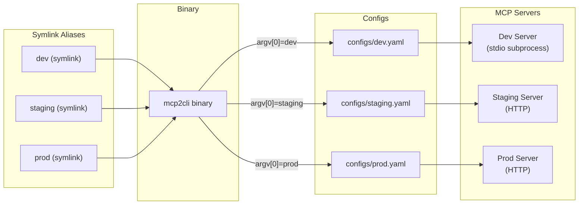
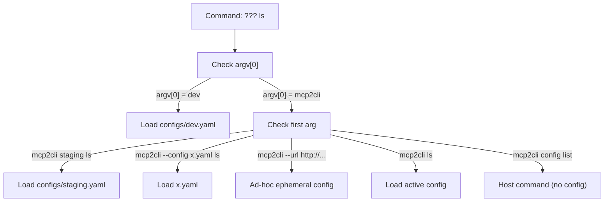

# Named Configs & Aliases

Manage multiple MCP servers with named configs and symlink aliases — each feels like its own standalone application.

---

## Architecture



---

## Creating Named Configs

```bash
# Stdio server
mcp2cli config init --name dev --app bridge --transport stdio \
  --stdio-command npx \
  --stdio-args '@modelcontextprotocol/server-everything'

# HTTP server
mcp2cli config init --name staging --app bridge \
  --transport streamable_http \
  --endpoint https://staging.api.company.com/mcp

# Another HTTP server
mcp2cli config init --name prod --app bridge \
  --transport streamable_http \
  --endpoint https://prod.api.company.com/mcp
```

### Managing Configs

```bash
mcp2cli config list              # List all named configs
mcp2cli config show --name dev   # Show config details
```

---

## Active Config

Set a default config so you don't need to specify it every time:

```bash
mcp2cli use dev                  # Set active config
mcp2cli ls                       # Uses "dev" config
mcp2cli echo --message hello     # Uses "dev" config

mcp2cli use staging              # Switch active
mcp2cli ls                       # Now uses "staging"

mcp2cli use --show               # Show current active
mcp2cli use --clear              # Clear active config
```

### Explicit Config Selection

Override the active config for a single command:

```bash
mcp2cli dev ls                   # Always uses "dev"
mcp2cli staging ls               # Always uses "staging"
mcp2cli --config /path/to/custom.yaml ls
```

---

## Symlink Aliases

Create symlinks that make each server feel like a standalone application:

```bash
mcp2cli link create --name dev
mcp2cli link create --name staging
mcp2cli link create --name prod
```

Now use them directly:

```bash
dev ls
dev echo --message hello
dev doctor

staging deploy --version 1.2.3
staging --json ls

prod inspect
prod auth status
```

### Custom Directory

By default, symlinks are created next to the mcp2cli binary. Place them elsewhere:

```bash
mcp2cli link create --name dev --dir /usr/local/bin
mcp2cli link create --name work --dir ~/bin
```

### Reserved Names

These names cannot be used as aliases: `mcp2cli`, `config`, `link`, `use`, `daemon`.

---

## Dispatch Routing

When mcp2cli starts, it determines the config from:

1. **argv[0]** — if invoked as `dev`, loads `configs/dev.yaml`
2. **`mcp2cli <name>`** — selector argument: `mcp2cli staging ls`
3. **`--config <path>`** — explicit config file path
4. **Active config** — `mcp2cli use <name>` sets the default
5. **`--url`/`--stdio`** — ad-hoc ephemeral config



---

## Per-Server Profiles

Each config can have its own profile overlay, so the same tools appear differently:

```yaml
# configs/mail.yaml
profile:
  display_name: "Mail CLI"
  aliases:
    search: find
  resource_verb: fetch

# configs/infra.yaml  
profile:
  display_name: "Infrastructure"
  groups:
    cluster:
      - deploy
      - rollback
      - scale
```

```bash
mail find --query "invoices"         # Aliased from "search"
mail fetch mail://inbox              # resource_verb: fetch

infra cluster deploy --version 2.0   # Custom group
infra cluster rollback               # Custom group
```

---

## File Layout

```text
~/.local/share/mcp2cli/
├── configs/
│   ├── dev.yaml
│   ├── staging.yaml
│   └── prod.yaml
├── instances/
│   ├── dev/
│   │   ├── discovery.json        # Cached capabilities
│   │   ├── tokens.json           # Auth credentials
│   │   ├── session.json          # Negotiated capabilities
│   │   ├── daemon.json           # Daemon PID (if running)
│   │   ├── daemon.sock           # Daemon socket (if running)
│   │   └── jobs/                 # Job records
│   ├── staging/
│   │   └── ...
│   └── prod/
│       └── ...
└── active.json                    # Currently active config
```

---

## Practical Patterns

### Team-Shared Configs

Check configs into your repo and set `MCP2CLI_CONFIG_DIR`:

```bash
export MCP2CLI_CONFIG_DIR=./mcp-configs
mcp2cli config list
```

### Environment-Specific Overrides

```bash
# Base config + environment override
MCP2CLI_SERVER__ENDPOINT=https://canary.api/mcp work deploy --version 2.0
```

### Config Validation

```bash
# Show parsed config to verify
mcp2cli config show --name prod

# Health check
prod doctor
```

---

## See Also

- [Getting Started](../getting-started.md) — initial config setup
- [Profile Overlays](profile-overlays.md) — customize per-server CLI surface
- [Ad-Hoc Connections](ad-hoc-connections.md) — when you don't want a config
- [Daemon Mode](daemon-mode.md) — keep connections warm per-config
- [Configuration Reference](../reference/config-reference.md) — full YAML schema
