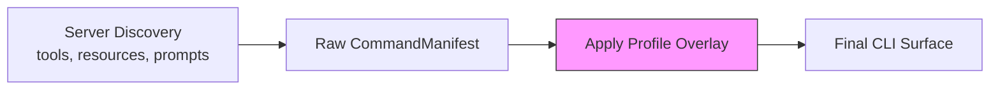

# Profile Overlays

Customize how server capabilities appear in the CLI — rename commands, hide internal tools, group related capabilities, and rename flags — without modifying the server.

---

## Overview

A **profile overlay** is an optional YAML section in your config that transforms the auto-generated CLI surface:

```yaml
# In your config YAML (e.g., configs/work.yaml)
profile:
  display_name: "Work CLI"
  aliases:
    long-running-operation: lro         # Rename a command
    get-tiny-image: image
    echo: ping                          # "echo" command becomes "ping"
    create.payload: object              # Rename grouped: "create payload" → "create object"
  hide:
    - debug-tool                        # Hide from help and ls
    - internal-probe
  groups:
    mail:                               # Custom grouping
      - send
      - reply
      - draft-create
  flags:
    echo:
      message: msg                      # Rename --message to --msg
  resource_verb: fetch                  # Use "fetch" instead of "get"
```

---

## Features

### Command Aliases

Rename commands to shorter or more intuitive names:

```yaml
profile:
  aliases:
    long-running-operation: lro
    get-tiny-image: image
```

**Before:** `work long-running-operation --duration 60`
**After:** `work lro --duration 60`

For grouped commands, use dot notation:

```yaml
profile:
  aliases:
    create.payload: object              # "create payload" → "create object"
```

### Hide Commands

Remove commands from `help` output and `ls` listings:

```yaml
profile:
  hide:
    - debug-tool
    - internal-probe
```

Hidden commands are not visible in `--help` or `ls`, but can still be called directly by the original name through the static bridge fallback.

### Custom Groups

Override the default dotted-name grouping with explicit groups:

```yaml
profile:
  groups:
    mail:
      - send
      - reply
      - draft-create
    admin:
      - user-create
      - user-delete
```

This creates `work mail send`, `work mail reply`, etc. regardless of the original tool names.

### Flag Aliases

Rename flags on specific commands:

```yaml
profile:
  flags:
    echo:
      message: msg                      # --message → --msg
    deploy:
      environment: env                  # --environment → --env
```

### Resource Verb

Change the verb used for direct resource reads:

```yaml
profile:
  resource_verb: fetch                  # "get" → "fetch"
```

**Before:** `work get demo://resource/readme.md`
**After:** `work fetch demo://resource/readme.md`

### Display Name

Customize the name shown in `--help` banners:

```yaml
profile:
  display_name: "Acme Production CLI"
```

---

## How Overlays Are Applied



The overlay is applied **after** the manifest is built from discovery, transforming the command tree in this order:

1. **Aliases** — rename commands and grouped subcommands
2. **Hide** — remove entries from the visible manifest
3. **Groups** — re-parent commands into custom groups
4. **Flags** — rename flags on specific commands
5. **Resource verb** — adjust the resource read command name

---

## Full Example

Given a server with these tools:

```
email.send, email.reply, email.draft.create, labels.add,
get-tiny-image, long-running-operation, debug-internal, echo
```

And this profile:

```yaml
profile:
  display_name: "Acme Mail CLI"
  aliases:
    long-running-operation: lro
    get-tiny-image: image
    echo: ping
  hide:
    - debug-internal
  flags:
    echo:
      message: msg
  resource_verb: fetch
```

The CLI becomes:

```bash
work email send --to user@example.com    # Grouped by dot notation
work email reply --thread-id 123
work email draft create --subject "New"
work labels add --name urgent
work image                                # Aliased from get-tiny-image
work lro --duration 60                    # Aliased from long-running-operation
work ping --msg hello                     # Aliased echo→ping, flag message→msg
work fetch demo://resource/readme.md      # resource_verb changed to fetch
# debug-internal is hidden from help/ls
```

---

## See Also

- [Discovery-Driven CLI](discovery-driven-cli.md) — how the base manifest is built
- [Named Configs & Aliases](named-configs-and-aliases.md) — different profiles per server
- [Configuration Reference](../reference/config-reference.md) — full profile schema
