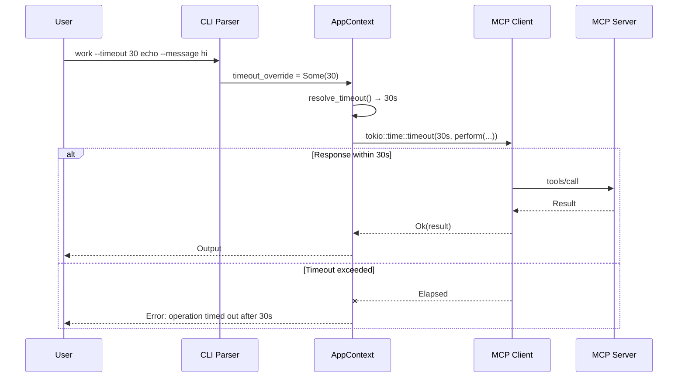

# Request Timeouts

Control how long mcp2cli waits for MCP server responses — globally via config, or per-command via the `--timeout` flag.

---

## Default Behavior

Every MCP operation has a **120-second timeout** by default. If the server doesn't respond within this window, the command fails with a timeout error rather than hanging indefinitely.

---

## Configuration

### In Config YAML

Set the default timeout for all operations on a server:

```yaml
defaults:
  timeout_seconds: 60    # 60 seconds for all operations
```

### Per-Command Override

Override the config default for a single invocation:

```bash
# Quick ping — 5 second timeout
work --timeout 5 ping

# Long-running operation — 10 minute timeout
work --timeout 600 deploy --version 2.0

# Disable timeout entirely
work --timeout 0 long-running-operation --heavy-input '...'
```

### Timeout Values

| Value | Behavior |
|-------|----------|
| `120` (default) | 2-minute timeout on all operations |
| `1`–`N` | Custom timeout in seconds |
| `0` | No timeout — wait indefinitely |

---

## How It Works



The timeout wraps the entire `perform()` call, which includes:
- Transport-level connection setup
- JSON-RPC request/response roundtrip
- Notification handling during the operation
- SSE stream reading (for HTTP transport)

---

## Precedence Rules

Timeout is resolved in this order (first match wins):

1. **`--timeout` CLI flag** — per-command override
2. **`defaults.timeout_seconds`** in config YAML — per-server default
3. **Built-in default** — 120 seconds

```bash
# Config says 60s, but this command uses 10s:
work --timeout 10 ping

# Config says 60s, no flag → 60s:
work echo --message hello

# No config override, no flag → 120s (built-in default):
mcp2cli --url http://localhost:3001/mcp echo --message hello
```

---

## Practical Examples

### Fast-fail health checks

```bash
# CI health check — fail fast if server is down
work --timeout 5 ping || echo "Server unreachable"
```

### Long-running data operations

```bash
# Data export that might take minutes
work --timeout 0 export --dataset full --format parquet
```

### Scripted retries with timeout

```bash
for i in 1 2 3; do
  if work --timeout 10 --json deploy --version "$VERSION" 2>/dev/null; then
    echo "Deploy succeeded"
    break
  fi
  echo "Attempt $i timed out, retrying..."
  sleep 5
done
```

### Different environments, different timeouts

```yaml
# configs/dev.yaml
defaults:
  timeout_seconds: 30       # Fast iteration

# configs/prod.yaml
defaults:
  timeout_seconds: 300      # Production needs more time
```

---

## See Also

- [Configuration Reference](../reference/config-reference.md) — `defaults.timeout_seconds` field
- [Background Jobs](background-jobs.md) — for truly long-running operations, use `--background` instead of long timeouts
- [Daemon Mode](daemon-mode.md) — warm connections reduce effective latency
