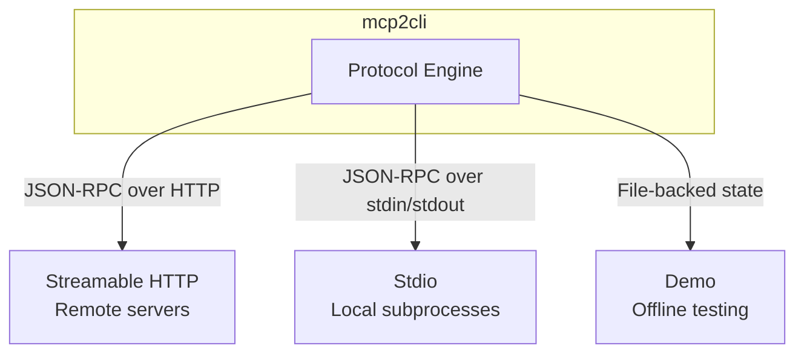

# Transports

mcp2cli supports three transport modes for connecting to MCP servers. Each transport handles the JSON-RPC communication layer differently.

---

## Overview



| Transport | Config Value | When to Use |
|-----------|-------------|-------------|
| **Streamable HTTP** | `streamable_http` | Remote servers, production, shared infrastructure |
| **Stdio** | `stdio` | Local development, testing, subprocess servers |
| **Demo** | `streamable_http` + `demo.invalid` endpoint | Learning, offline testing, CI fixtures |

---

## Streamable HTTP

Connects to a remote MCP server over HTTP with JSON-RPC request/response cycles and SSE (Server-Sent Events) for streaming.

### Configuration

```yaml
server:
  transport: streamable_http
  endpoint: http://127.0.0.1:3001/mcp
```

### How It Works

1. **Initialization:** Sends `initialize` request with client capabilities
2. **Session negotiation:** Server may return a session ID via `Mcp-Session-Id` header
3. **Operations:** Each MCP operation is a POST with JSON-RPC body
4. **SSE responses:** The server can stream responses as SSE events
5. **Notifications:** Server notifications arrive via the SSE stream

### Authentication

Add an `Authorization` header automatically via `auth login`:

```bash
work auth login
# Prompted for token → stored in instances/<name>/tokens.json
# All subsequent requests include the Authorization header
```

### Running a Test Server

```bash
npx @modelcontextprotocol/server-everything streamableHttp
# Listening on http://127.0.0.1:3001/mcp
```

---

## Stdio

Spawns a local subprocess and communicates via line-delimited JSON-RPC over stdin/stdout.

### Configuration

```yaml
server:
  transport: stdio
  stdio:
    command: npx
    args: ['@modelcontextprotocol/server-everything']
    cwd: /path/to/project           # Optional working directory
    env:                             # Optional environment variables
      API_KEY: sk-abc123
      NODE_ENV: development
```

### How It Works

1. **Spawn:** mcp2cli starts the subprocess with the given command/args
2. **Initialize:** Sends JSON-RPC `initialize` over stdin
3. **Operations:** Writes JSON-RPC requests to stdin, reads responses from stdout
4. **Notifications:** Server notifications arrive on stdout between responses
5. **Shutdown:** Sends stdin EOF when done; subprocess exits

### Key Behaviors

- **Process lifetime:** The subprocess lives for the duration of the CLI command. Use [Daemon Mode](daemon-mode.md) to keep it alive.
- **stderr passthrough:** The subprocess stderr is inherited for debugging (server log messages appear in terminal)
- **Environment variables:** The `env` map is merged with the current environment

### Running a Test Server

```bash
# This is what mcp2cli spawns internally:
npx @modelcontextprotocol/server-everything
```

---

## Demo Mode

A file-backed backend that simulates an MCP server without network or subprocess. Ideal for learning and testing.

### Configuration

```yaml
server:
  transport: streamable_http
  endpoint: https://demo.invalid/mcp    # Magic demo endpoint
```

### How It Works

When the endpoint is `demo.invalid`, mcp2cli activates the demo backend:

- **Discovery:** Returns a static set of tools, resources, and prompts
- **Tool calls:** Echo back arguments with mock responses
- **State:** Persisted to `~/.local/share/mcp2cli/demo-remote-state.json`
- **No network:** Everything runs locally in-process

### Use Cases

- Learning mcp2cli without setting up a real server
- CI/CD tests that need deterministic MCP behavior
- Documentation examples

```bash
mcp2cli config init --name demo --app bridge \
  --transport streamable_http --endpoint https://demo.invalid/mcp

mcp2cli use demo
mcp2cli ls          # Shows demo capabilities
mcp2cli echo --message "hello"
```

---

## Ad-Hoc Transport Selection

Skip config files entirely with `--url` or `--stdio`:

```bash
# HTTP — creates ephemeral streamable_http config
mcp2cli --url http://127.0.0.1:3001/mcp ls

# Stdio — creates ephemeral stdio config
mcp2cli --stdio "npx @modelcontextprotocol/server-everything" ls

# Stdio with environment
mcp2cli --stdio "python server.py" --env API_KEY=secret echo --message test
```

See [Ad-Hoc Connections](ad-hoc-connections.md) for full details.

---

## Transport Comparison

| Feature | Streamable HTTP | Stdio | Demo |
|---------|----------------|-------|------|
| Remote servers | ✅ | ❌ | ❌ |
| Local subprocess | ❌ | ✅ | ❌ |
| Offline operation | ❌ | ❌ | ✅ |
| Session persistence | Via Mcp-Session-Id | Process lifetime | File-backed |
| Auth support | ✅ Bearer tokens | ❌ | ❌ |
| SSE streaming | ✅ | N/A | N/A |
| Daemon compatible | ✅ | ✅ | ✅ |
| Startup latency | Network RTT | Process spawn | ~0ms |

---

## See Also

- [Ad-Hoc Connections](ad-hoc-connections.md) — `--url` and `--stdio` without config
- [Daemon Mode](daemon-mode.md) — keep connections warm
- [Configuration Reference](../reference/config-reference.md) — full server config options
