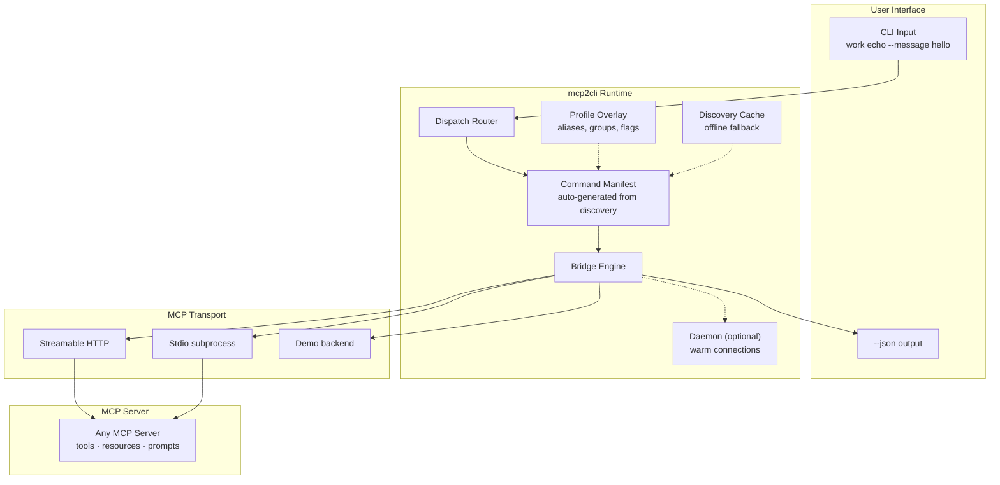

# mcp2cli Documentation

**mcp2cli** turns any MCP server into a native command-line application. Server tools become verbs, resources become nouns, prompts become workflows — no MCP protocol knowledge required at the command line.

```bash
# One binary. Any server. Real CLI commands.
work echo --message hello
work email send --to user@example.com --body "Meeting at 3"
work get file:///project/README.md
staging deploy --version 2.1.0 --background
```

---

## Why mcp2cli?

| Problem | mcp2cli Solution |
|---------|-----------------|
| MCP requires JSON-RPC plumbing to interact with servers | Auto-discovers capabilities → typed CLI commands |
| Testing MCP servers needs custom client code | `mcp2cli ls`, `mcp2cli echo --message test` — instant validation |
| AI agents can't easily call MCP tools | JSON output mode + structured envelopes for programmatic parsing |
| Each server needs its own CLI wrapper | One binary + config files = unlimited server bindings |
| CI/CD pipelines can't orchestrate MCP | `--json` output, `--non-interactive` mode, exit codes, pipes |

---

## Architecture at a Glance



---

## Documentation Map

### Getting Started

| Document | Description |
|----------|-------------|
| [Getting Started](getting-started.md) | Install, configure, and run your first command in under a minute |
| [Configuration Reference](reference/config-reference.md) | Complete YAML config schema with every field explained |
| [CLI Reference](reference/cli-reference.md) | Every command, flag, and option in one place |
| [Telemetry](telemetry-collection.md) | What's collected, how to opt out, and how to set up a backend |

### Feature Guides

Each major feature has its own deep-dive page with examples, diagrams, and best practices.

| Feature | Page | Summary |
|---------|------|---------|
| Discovery-Driven CLI | [features/discovery-driven-cli.md](features/discovery-driven-cli.md) | How server capabilities become typed CLI commands |
| Profile Overlays | [features/profile-overlays.md](features/profile-overlays.md) | Rename, hide, group, and customize commands |
| Transports | [features/transports.md](features/transports.md) | HTTP, Stdio, and Demo transport configuration |
| Ad-Hoc Connections | [features/ad-hoc-connections.md](features/ad-hoc-connections.md) | `--url` and `--stdio` for config-free usage |
| Request Timeouts | [features/request-timeouts.md](features/request-timeouts.md) | Per-config and per-command timeout control |
| Fuzzy Matching | [features/fuzzy-matching.md](features/fuzzy-matching.md) | "Did you mean?" suggestions for mistyped commands |
| Daemon Mode | [features/daemon-mode.md](features/daemon-mode.md) | Keep MCP connections warm between invocations |
| Background Jobs | [features/background-jobs.md](features/background-jobs.md) | `--background` flag and the jobs/tasks system |
| Event System | [features/event-system.md](features/event-system.md) | Webhooks, Unix sockets, SSE, and command sinks |
| Authentication | [features/authentication.md](features/authentication.md) | Token management and auth flows |
| Output Formats | [features/output-formats.md](features/output-formats.md) | Human, JSON, and NDJSON output modes |
| Elicitation & Sampling | [features/elicitation-and-sampling.md](features/elicitation-and-sampling.md) | Interactive server-initiated prompts |
| Named Configs & Aliases | [features/named-configs-and-aliases.md](features/named-configs-and-aliases.md) | Multi-server setup with symlink aliases |

### Articles & Guides

In-depth walkthroughs for specific use cases and audiences.

| Article | Audience |
|---------|----------|
| [AI Agents + MCP via CLI](articles/ai-agents-mcp-cli.md) | Agent developers who want tool-use through shell |
| [Testing MCP Servers](articles/testing-mcp-servers.md) | Server authors validating protocol compliance |
| [E2E & Conformance Testing](articles/e2e-conformance-testing.md) | Server authors building structured conformance test suites |
| [Shell Scripting with MCP](articles/shell-scripting-mcp.md) | DevOps teams building CI/CD pipelines |
| [Multi-Server Workflows](articles/multi-server-workflows.md) | Platform engineers orchestrating multiple servers |
| [Local Development & Prototyping](articles/local-dev-prototyping.md) | Server developers iterating on MCP implementations |
| [Platform Engineering](articles/platform-engineering.md) | Infrastructure teams automating ops through MCP |
| [From Zero to Production](articles/from-zero-to-production.md) | End-to-end production deployment guide |

---

## Quick Links

- **Install:** See [Getting Started](getting-started.md)
- **Config example:** [`config.example.yaml`](../config.example.yaml)
- **Source:** [repository root](../../)
- **Tests:** `cargo test -p mcp2cli`
