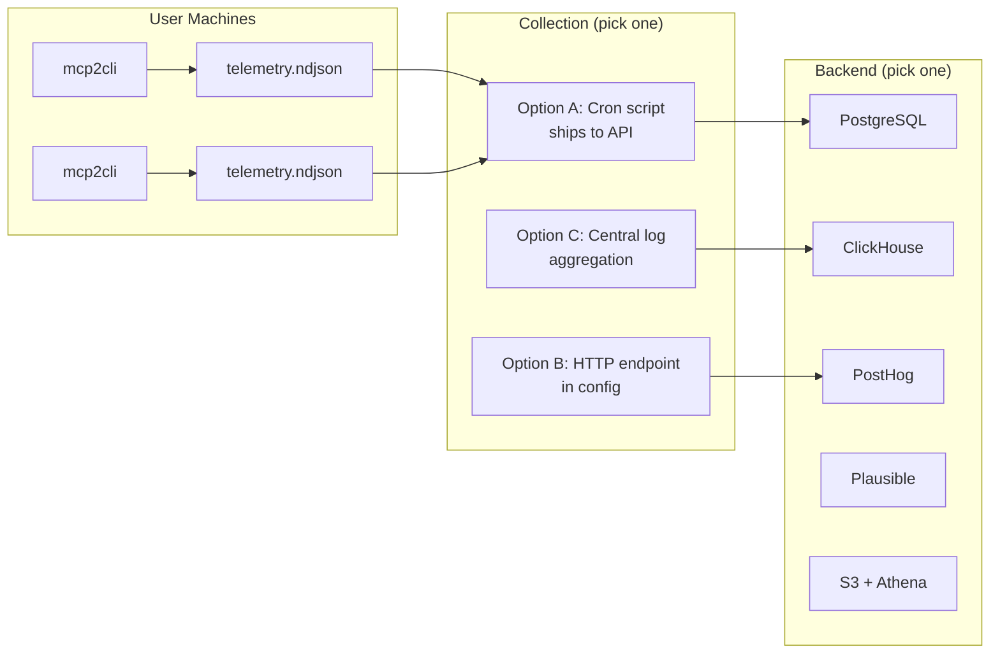

# Telemetry: Collection & Backend Setup

*How mcp2cli telemetry works, what's collected, and how to set up a backend to aggregate usage data — without vendor lock-in.*

---

## Overview

mcp2cli includes opt-out anonymous usage telemetry. It helps the team understand:

- Which features are actually used (and which are dead weight)
- What transports and configurations are popular
- Where errors occur most often
- How long operations take in real usage

The system is designed with three principles:

1. **Privacy first** — no sensitive data, no identity, no tracking
2. **Vendor agnostic** — local NDJSON files + HTTP POST to any
   collector (defaults to a first-party endpoint, can be redirected
   or disabled in config)
3. **User control** — multiple opt-out mechanisms, full data transparency

## Default collector

Out of the box, batched events are POSTed to
`https://otel.mcp2cli.dev/v1/traces` as **OTLP/HTTP JSON
spans** — the standard OpenTelemetry wire format. Any OTEL
Collector can ingest them natively; the only server-side code is
whatever routes traffic to the Collector. No third-party trackers.
Override the URL with `telemetry.endpoint` in your config, set it
to `null` to keep events purely local, or opt out entirely via any
of the mechanisms below.

## Install attribution (three IDs)

To close the loop between "someone copied the curl install command
on the website" and "someone ran `mcp2cli` for the first time",
three random UUIDs flow through the pipeline:

| ID | Created by | Lifetime | Purpose |
|---|---|---|---|
| `visitor_id` | Browser (`sessionStorage`) on first page visit | One browser session | Groups page-views + install-command copies into one journey |
| `install_id` | `install.sh` at run time | One install attempt | Unique per curl invocation; lets us measure install-to-first-run conversion |
| `installation_id` | CLI on first run (`telemetry_id` file) | Lifetime of the installed binary | Groups every `mcp2cli` command run on this machine |

`install.sh` writes `visitor_id` + `install_id` to
`~/.local/share/mcp2cli/install_ref`. The first `mcp2cli` run
reads the file, attaches both IDs to its `first_run` span, and
deletes the file (one-shot). Subsequent commands are correlated
via `installation_id` alone.

Every opt-out mechanism (`DO_NOT_TRACK`, `MCP2CLI_TELEMETRY=off`,
`telemetry.enabled: false`, `--no-telemetry`, a `mcp2cli_no_track`
localStorage flag in the browser) suppresses *all three* — the
browser omits the `--ref=` flag, the installer skips its beacon,
and the CLI never ships events. None of the IDs identifies a
person.

---

## What's Collected

Each CLI invocation produces one event with this schema:

```json
{
  "schema": 1,
  "installation_id": "550e8400-e29b-41d4-a716-446655440000",
  "timestamp": "2026-03-30T14:22:00Z",
  "cli_version": "0.1.0",
  "os": "linux",
  "arch": "x86_64",
  "event": {
    "type": "command_run",
    "command_category": "tool_invoke",
    "transport": "streamable_http",
    "json_output": false,
    "background": false,
    "timeout_override": false,
    "profile_active": true,
    "daemon_active": false,
    "ad_hoc": false,
    "outcome": "success",
    "duration_ms": 342
  }
}
```

### Fields Explained

| Field | Purpose | Example Values |
|-------|---------|----------------|
| `schema` | Event schema version for forward compatibility | `1` |
| `installation_id` | Random UUID per installation — not user-identifying | UUID v4 |
| `timestamp` | When the command ran (UTC) | ISO-8601 |
| `cli_version` | mcp2cli version | `"0.1.0"` |
| `os` | Operating system family | `"linux"`, `"macos"`, `"windows"` |
| `arch` | CPU architecture | `"x86_64"`, `"aarch64"` |
| `command_category` | What type of command (NOT the actual name) | See table below |
| `transport` | Connection type used | `"streamable_http"`, `"stdio"`, `"configured"`, `"ad_hoc"`, `"none"` |
| `json_output` | Whether `--json` was passed | `true`/`false` |
| `background` | Whether `--background` was used | `true`/`false` |
| `timeout_override` | Whether `--timeout` was explicitly set | `true`/`false` |
| `profile_active` | Whether a profile overlay was in use | `true`/`false` |
| `daemon_active` | Whether daemon mode was active | `true`/`false` |
| `ad_hoc` | Whether `--url`/`--stdio` ad-hoc mode was used | `true`/`false` |
| `outcome` | Result of the command | `"success"`, `"error"` |
| `duration_ms` | Wall-clock time in milliseconds | `342` |

### Command Categories

| Category | Maps to |
|----------|---------|
| `tool_invoke` | Any tool call (the tool name is NOT recorded) |
| `resource_read` | `get <URI>` |
| `prompt_run` | Any prompt execution |
| `discover` | `ls` |
| `ping` | `ping` |
| `doctor` | `doctor` |
| `inspect` | `inspect` |
| `auth` | `auth login/logout/status` |
| `jobs` | `jobs list/show/wait/cancel/watch` |
| `log` | `log <level>` |
| `complete` | `complete` |
| `subscribe` | `subscribe`/`unsubscribe` |
| `config` | `config init/list/show` |
| `link` | `link create` |
| `use` | `use <name>` |
| `daemon` | `daemon start/stop/status` |
| `command` | Other server-derived commands |

### Special Events

| Event Type | When | Sent |
|------------|------|------|
| `first_run` | First time mcp2cli runs on an installation | Once per installation |
| `command_run` | Every CLI invocation | Per invocation |

---

## What's NOT Collected

This is explicit and permanent — these items will never be added:

- **No server endpoints or URLs** — we don't know where your MCP server lives
- **No tool/prompt/resource names** — we don't know what your server offers
- **No argument values** — we don't see your data, messages, or payloads
- **No file paths** — we don't know your directory structure
- **No config content** — we don't read your YAML beyond telemetry settings
- **No environment variables** — we don't see your credentials or secrets
- **No IP addresses** — the local NDJSON mode has no network component
- **No user identifiers** — the installation_id is a random UUID

---

## Opt-Out Mechanisms

Any one of these disables telemetry:

### 1. Config File

```yaml
telemetry:
  enabled: false
```

### 2. Environment Variable

```bash
export MCP2CLI_TELEMETRY=off   # or: false, 0, no, disabled
```

### 3. CLI Flag

```bash
mcp2cli --no-telemetry ls
```

### 4. DO_NOT_TRACK Standard

```bash
export DO_NOT_TRACK=1
```

Following the [Console Do Not Track](https://consoledonottrack.com/) standard used by Homebrew, Gatsby, and other CLI tools.

### Precedence

```text
--no-telemetry flag > MCP2CLI_TELEMETRY env > DO_NOT_TRACK env > config enabled field
```

If any of these signals "off", telemetry is fully disabled for that invocation.

---

## Local Data Storage

Events are written to:

```text
~/.local/share/mcp2cli/telemetry.ndjson
```

This is a standard newline-delimited JSON file. You can:

```bash
# View events
cat ~/.local/share/mcp2cli/telemetry.ndjson | jq '.'

# Count events
wc -l ~/.local/share/mcp2cli/telemetry.ndjson

# See command distribution
cat ~/.local/share/mcp2cli/telemetry.ndjson | \
  jq -r '.event.command_category // .event.type' | sort | uniq -c | sort -rn

# See error rate
cat ~/.local/share/mcp2cli/telemetry.ndjson | \
  jq -r 'select(.event.outcome == "error") | .event.command_category'

# Delete all data
rm ~/.local/share/mcp2cli/telemetry.ndjson

# See your installation ID
cat ~/.local/share/mcp2cli/telemetry_id
```

### Other Files

| File | Purpose |
|------|---------|
| `telemetry_id` | Random UUID identifying this installation |
| `telemetry_first_run` | Marker file — first-run event already sent |
| `telemetry.ndjson` | Event log (append-only) |
| `telemetry.pending.json` | Pending batch for HTTP shipping (temporary) |

---

## Setting Up a Collection Backend

The mcp2cli telemetry system is vendor-agnostic. Events are NDJSON — any system that accepts JSON can be a backend.

### Architecture Options



---

### Option A: Simple Cron-Based Collection (Recommended Starting Point)

The simplest approach — a cron job ships events from the local file to your backend.

#### 1. Collector Script

```bash
#!/bin/bash
# /usr/local/bin/mcp2cli-telemetry-ship.sh
# Ships telemetry events to an HTTP endpoint and rotates the local file.

TELEMETRY_FILE="$HOME/.local/share/mcp2cli/telemetry.ndjson"
ENDPOINT="${MCP2CLI_TELEMETRY_ENDPOINT:-https://your-collector.example.com/v1/events}"

if [ ! -f "$TELEMETRY_FILE" ] || [ ! -s "$TELEMETRY_FILE" ]; then
  exit 0
fi

# Atomically move the file to avoid race with mcp2cli
BATCH="/tmp/mcp2cli-telemetry-batch-$$.ndjson"
mv "$TELEMETRY_FILE" "$BATCH"

# Ship as JSON array
PAYLOAD=$(jq -s '.' "$BATCH")
HTTP_CODE=$(curl -sf -o /dev/null -w "%{http_code}" \
  -X POST "$ENDPOINT" \
  -H "Content-Type: application/json" \
  -d "$PAYLOAD")

if [ "$HTTP_CODE" = "200" ] || [ "$HTTP_CODE" = "202" ]; then
  rm "$BATCH"
else
  # Put events back on failure
  cat "$BATCH" >> "$TELEMETRY_FILE"
  rm "$BATCH"
fi
```

#### 2. Cron Entry

```bash
# Ship telemetry every hour
0 * * * * /usr/local/bin/mcp2cli-telemetry-ship.sh
```

#### 3. Minimal HTTP Collector (Node.js)

```javascript
// collector.js — receives telemetry batches and appends to a file
const http = require('http');
const fs = require('fs');

const LOG_FILE = '/var/log/mcp2cli-telemetry.ndjson';

http.createServer((req, res) => {
  if (req.method !== 'POST') {
    res.writeHead(405).end();
    return;
  }
  let body = '';
  req.on('data', chunk => body += chunk);
  req.on('end', () => {
    try {
      const events = JSON.parse(body);
      const lines = events.map(e => JSON.stringify(e)).join('\n') + '\n';
      fs.appendFileSync(LOG_FILE, lines);
      res.writeHead(202).end();
    } catch {
      res.writeHead(400).end();
    }
  });
}).listen(9090, () => console.log('Telemetry collector on :9090'));
```

---

### Option B: Built-in HTTP Shipping

Configure the mcp2cli to POST events directly to your endpoint:

```yaml
telemetry:
  enabled: true
  endpoint: "https://your-collector.example.com/v1/events"
  batch_size: 25
```

Events are batched locally and shipped as a JSON array when the batch is full. The endpoint receives:

```http
POST /v1/events HTTP/1.1
Content-Type: application/json

[
  {"schema":1,"installation_id":"...","event":{"type":"command_run",...}},
  {"schema":1,"installation_id":"...","event":{"type":"command_run",...}}
]
```

---

### Option C: PostHog (Self-Hosted or Cloud)

[PostHog](https://posthog.com/) is open-source product analytics, self-hostable, with a generous free tier.

#### Setup

1. Deploy PostHog (Docker or cloud)
2. Create a project and get your API key
3. Set up a collector that translates events to PostHog format:

```python
# posthog-relay.py — translates mcp2cli events to PostHog capture API
import json, sys, requests

POSTHOG_HOST = "https://your-posthog.example.com"
API_KEY = "phc_your_project_api_key"

for line in sys.stdin:
    event = json.loads(line)
    kind = event["event"]
    props = {
        "cli_version": event["cli_version"],
        "os": event["os"],
        "arch": event["arch"],
    }
    if kind.get("type") == "command_run":
        props.update({
            "command_category": kind["command_category"],
            "transport": kind["transport"],
            "outcome": kind["outcome"],
            "duration_ms": kind["duration_ms"],
            "json_output": kind["json_output"],
            "background": kind["background"],
            "ad_hoc": kind["ad_hoc"],
        })
    requests.post(f"{POSTHOG_HOST}/capture/", json={
        "api_key": API_KEY,
        "event": kind.get("type", "unknown"),
        "distinct_id": event["installation_id"],
        "properties": props,
        "timestamp": event["timestamp"],
    })
```

Usage:

```bash
cat /var/log/mcp2cli-telemetry.ndjson | python posthog-relay.py
```

---

### Option D: PostgreSQL

Direct storage in PostgreSQL for teams who want SQL analytics.

#### Schema

```sql
CREATE TABLE mcp2cli_telemetry (
    id BIGSERIAL PRIMARY KEY,
    received_at TIMESTAMPTZ DEFAULT now(),
    schema_version INT NOT NULL,
    installation_id UUID NOT NULL,
    event_timestamp TIMESTAMPTZ NOT NULL,
    cli_version TEXT NOT NULL,
    os TEXT NOT NULL,
    arch TEXT NOT NULL,
    event_type TEXT NOT NULL,
    command_category TEXT,
    transport TEXT,
    json_output BOOLEAN,
    background BOOLEAN,
    timeout_override BOOLEAN,
    profile_active BOOLEAN,
    daemon_active BOOLEAN,
    ad_hoc BOOLEAN,
    outcome TEXT,
    duration_ms BIGINT
);

CREATE INDEX idx_telemetry_ts ON mcp2cli_telemetry (event_timestamp);
CREATE INDEX idx_telemetry_category ON mcp2cli_telemetry (command_category);
CREATE INDEX idx_telemetry_installation ON mcp2cli_telemetry (installation_id);
```

#### Ingest Script

```bash
#!/bin/bash
# ingest-to-postgres.sh
DB_URL="${TELEMETRY_DB_URL:-postgres://localhost/mcp2cli}"

cat /var/log/mcp2cli-telemetry.ndjson | jq -r '
  [
    .schema,
    .installation_id,
    .timestamp,
    .cli_version,
    .os,
    .arch,
    (.event.type // "unknown"),
    (.event.command_category // null),
    (.event.transport // null),
    (.event.json_output // null),
    (.event.background // null),
    (.event.timeout_override // null),
    (.event.profile_active // null),
    (.event.daemon_active // null),
    (.event.ad_hoc // null),
    (.event.outcome // null),
    (.event.duration_ms // null)
  ] | @csv
' | psql "$DB_URL" -c "
COPY mcp2cli_telemetry (
  schema_version, installation_id, event_timestamp, cli_version,
  os, arch, event_type, command_category, transport,
  json_output, background, timeout_override, profile_active,
  daemon_active, ad_hoc, outcome, duration_ms
) FROM STDIN WITH CSV;
"
```

#### Example Queries

```sql
-- Top 10 most-used commands
SELECT command_category, COUNT(*) as uses
FROM mcp2cli_telemetry
WHERE event_type = 'command_run'
GROUP BY command_category
ORDER BY uses DESC
LIMIT 10;

-- Error rate by command category
SELECT
  command_category,
  COUNT(*) FILTER (WHERE outcome = 'error') AS errors,
  COUNT(*) AS total,
  ROUND(100.0 * COUNT(*) FILTER (WHERE outcome = 'error') / COUNT(*), 1) AS error_pct
FROM mcp2cli_telemetry
WHERE event_type = 'command_run'
GROUP BY command_category
ORDER BY error_pct DESC;

-- Feature adoption over time (weekly)
SELECT
  date_trunc('week', event_timestamp) AS week,
  COUNT(*) FILTER (WHERE json_output) AS json_users,
  COUNT(*) FILTER (WHERE background) AS background_users,
  COUNT(*) FILTER (WHERE daemon_active) AS daemon_users,
  COUNT(*) FILTER (WHERE ad_hoc) AS adhoc_users,
  COUNT(*) FILTER (WHERE profile_active) AS profile_users
FROM mcp2cli_telemetry
WHERE event_type = 'command_run'
GROUP BY week
ORDER BY week;

-- P50/P95/P99 latency by command
SELECT
  command_category,
  PERCENTILE_CONT(0.50) WITHIN GROUP (ORDER BY duration_ms) AS p50_ms,
  PERCENTILE_CONT(0.95) WITHIN GROUP (ORDER BY duration_ms) AS p95_ms,
  PERCENTILE_CONT(0.99) WITHIN GROUP (ORDER BY duration_ms) AS p99_ms
FROM mcp2cli_telemetry
WHERE event_type = 'command_run' AND outcome = 'success'
GROUP BY command_category;

-- Unique installations per week
SELECT
  date_trunc('week', event_timestamp) AS week,
  COUNT(DISTINCT installation_id) AS active_installs
FROM mcp2cli_telemetry
GROUP BY week
ORDER BY week;

-- OS/Arch distribution
SELECT os, arch, COUNT(DISTINCT installation_id) AS installs
FROM mcp2cli_telemetry
GROUP BY os, arch
ORDER BY installs DESC;
```

---

### Option E: ClickHouse (High Volume)

For high-volume deployments, ClickHouse is ideal for analytics on append-only event data.

```sql
CREATE TABLE mcp2cli_telemetry (
    installation_id UUID,
    event_timestamp DateTime64(3),
    cli_version LowCardinality(String),
    os LowCardinality(String),
    arch LowCardinality(String),
    event_type LowCardinality(String),
    command_category LowCardinality(String),
    transport LowCardinality(String),
    outcome LowCardinality(String),
    duration_ms UInt64,
    json_output Bool,
    background Bool,
    ad_hoc Bool
) ENGINE = MergeTree()
ORDER BY (event_timestamp, installation_id);
```

---

### Option F: S3 + Athena (Serverless)

For AWS-native teams: ship NDJSON to S3, query with Athena.

```bash
# Ship to S3
aws s3 cp /var/log/mcp2cli-telemetry.ndjson \
  s3://your-bucket/telemetry/$(date +%Y/%m/%d)/batch-$(date +%s).ndjson
```

Athena external table:

```sql
CREATE EXTERNAL TABLE mcp2cli_telemetry (
    schema INT,
    installation_id STRING,
    timestamp STRING,
    cli_version STRING,
    os STRING,
    arch STRING,
    event STRUCT<
        type: STRING,
        command_category: STRING,
        transport: STRING,
        outcome: STRING,
        duration_ms: BIGINT,
        json_output: BOOLEAN,
        background: BOOLEAN,
        ad_hoc: BOOLEAN
    >
)
ROW FORMAT SERDE 'org.openx.data.jsonserde.JsonSerDe'
LOCATION 's3://your-bucket/telemetry/';
```

---

## Dashboard Queries (Backend-Agnostic)

These queries work against the NDJSON data regardless of backend. Use `jq` for local analysis or translate to SQL.

### Feature Adoption Report

```bash
# Which features are people actually using?
cat telemetry.ndjson | jq -r '
  select(.event.type == "command_run") |
  [
    (if .event.json_output then "json_output" else empty end),
    (if .event.background then "background" else empty end),
    (if .event.ad_hoc then "ad_hoc" else empty end),
    (if .event.profile_active then "profile" else empty end),
    (if .event.daemon_active then "daemon" else empty end),
    (if .event.timeout_override then "timeout" else empty end)
  ] | .[]
' | sort | uniq -c | sort -rn
```

### Version Adoption

```bash
cat telemetry.ndjson | jq -r '.cli_version' | sort | uniq -c | sort -rn
```

### Slowest Commands

```bash
cat telemetry.ndjson | jq -r '
  select(.event.type == "command_run" and .event.outcome == "success") |
  "\(.event.duration_ms)ms \(.event.command_category)"
' | sort -rn | head -20
```

---

## Privacy Audit Checklist

Use this checklist to verify the telemetry implementation meets privacy requirements:

- [ ] Events contain no server endpoints or URLs
- [ ] Events contain no tool/prompt/resource names
- [ ] Events contain no argument values or payloads
- [ ] Events contain no file paths
- [ ] Events contain no environment variables
- [ ] Installation ID is a random UUID (not derived from user info)
- [ ] Opt-out via config works (`telemetry.enabled: false`)
- [ ] Opt-out via env var works (`MCP2CLI_TELEMETRY=off`)
- [ ] Opt-out via CLI flag works (`--no-telemetry`)
- [ ] `DO_NOT_TRACK=1` disables telemetry
- [ ] Local NDJSON file is human-readable and inspectable
- [ ] Users can delete telemetry data at any time
- [ ] No telemetry is sent during CI (if `DO_NOT_TRACK` is set)

---

## Industry References

The mcp2cli telemetry design follows established patterns from:

| Project | Model | Docs |
|---------|-------|------|
| [Homebrew](https://docs.brew.sh/Analytics) | Opt-out, anonymous, Google Analytics | `HOMEBREW_NO_ANALYTICS=1` |
| [Rust/Cargo](https://blog.rust-lang.org/2020/01/31/conf-2020-upgrade.html) | Survey-based (no runtime telemetry) | — |
| [VS Code](https://code.visualstudio.com/docs/getstarted/telemetry) | Opt-out, detailed levels, Application Insights | Settings UI |
| [Next.js](https://nextjs.org/telemetry) | Opt-out, anonymous, PostHog | `npx next telemetry disable` |
| [Gatsby](https://www.gatsbyjs.com/docs/telemetry/) | Opt-out, anonymous | `gatsby telemetry --disable` |
| [.NET CLI](https://learn.microsoft.com/en-us/dotnet/core/tools/telemetry) | Opt-out, anonymous, Application Insights | `DOTNET_CLI_TELEMETRY_OPTOUT=1` |

---

## See Also

- [Config Reference](reference/config-reference.md) — `telemetry` config section
- [CLI Reference](reference/cli-reference.md) — `--no-telemetry` flag
